# Malikia Pulse — avancement visuel

**État au 28 août 2026 : `WP2A_LOCAL_VALIDATED` · `ACCOUNT_OWNER_PAYER_CONFIRMED` · `BUFFER_COMMERCIAL_BASELINE_DOCUMENTED` · `BUFFER_LOGICAL_REQUEST_EVIDENCE_INSTRUMENTED` · `PRE_WP2B_INVENTORY_LOCAL_VALIDATED` · `PRE_WP2B_QUEUE_SCOPE_TOOLING_VALIDATED` · `MYSQL_COMPATIBILITY_GATE_VALIDATED` · `WP2B_SCHEMA_GATE_PENDING` · `P0_GATES_OPEN` · `NO_GO_BUFFER_RUNTIME` · `NO_GO_BUFFER_PILOT` · `NO_GO_BUFFER_PRODUCTION`**

**Checkpoint distant : `feature/pulse-buffer-refonte@879d4a130b52`**

**Dernier lot publié : compteur d'opérations GraphQL logiques, redaction des erreurs et conservation des preuves sur erreur de verrou**

**Vérification distante : 6 fichiers attendus, branche synchronisée, aucun incident Nightwatch ouvert**

```mermaid
flowchart LR
    subgraph DONE["✅ ÉTAPES TERMINÉES"]
        direction TB
        D0["WP0 — Stabilisation<br/>Workflow, sécurité OAuth/PKCE,<br/>concurrence, interface et validations"]
        D1A["WP1-A — Lecture Buffer<br/>Compte, organisation, canaux<br/>et quotas observés"]
        D1B["WP1-B — Contrat GraphQL<br/>Schéma authentifié en lecture seule"]
        D1C["WP1-C — Essais Facebook sécurisés<br/>Harnais validé et deux créations refusées<br/>sans objet distant"]
        D1D["WP1-D — Métadonnées Facebook<br/>Contrat introspecté et confirmé"]
        D1E["WP1-E — Contrat post Facebook<br/>facebook.type=post préparé<br/>et validé localement"]
        D1F["WP1-F — Preuve Facebook réelle<br/>Brouillon créé, edit refusé,<br/>suppression confirmée"]
        D1G["WP1-G — Édition durcie<br/>Metadata exacte, ambiguïtés<br/>et reprise couvertes localement"]
        D1H["WP1-H — Preuve edit réelle<br/>Create/edit/delete confirmés,<br/>move draft refusé proprement"]
        D1I["WP1-I — Capacité par statut<br/>move@draft = frontière négative<br/>provisoire, typée et non retryable"]
        DQ["Hygiène du code<br/>Statut spéculatif et branche morte retirés,<br/>suppressions incertaines différées au clone"]
        D2["WP2-A — Contrat/fake local<br/>Port et DTO/résultat text-only,<br/>fake déterministe, 9 tests verts"]
        DI["Pré-WP2-B — Inventaire legacy<br/>CLI agrégé read-only validé<br/>base MySQL locale inventoriée"]
        DM["Gate MySQL réel<br/>Driver vérifié, base isolée protégée,<br/>171 tests et 1 618 assertions"]
        DS["Ciblage de queue explicite<br/>Queue database renommée mesurable,<br/>queue externe identifiée sans connexion"]
        DC["BUF-P0-10 — Base commerciale<br/>Prix officiels et prérequis documentés,<br/>Essentials recommandé côté client"]
        DJ["BUF-P0-10 — Compteur logique local<br/>8 opérations cycle, 6 cleanup-only,<br/>redaction et erreur de verrou couvertes"]

        D0 --> D1A --> D1B --> D1C --> D1D --> D1E --> D1F --> D1G --> D1H --> D1I --> DQ --> D2 --> DI --> DM --> DS --> DC --> DJ
    end

    subgraph TODO["⏳ RESTE À FAIRE / GATES LOCAUX ET DISTANTS"]
        direction TB
        T0["Fin WP0<br/>Répétition MySQL, approbation opérationnelle<br/>et déploiement atomique"]
        T1["Fin WP1 / preuves BUF-P0<br/>Prouver replanification, accès, quotas,<br/>médias, juridique et support fournisseur"]
        GR["Gate runtime Buffer<br/>Webhook ou polling accepté,<br/>corrélation/idempotence et P0 applicables"]
        GP["Gate pilote / production<br/>Médias, juridique, capacité,<br/>modèle commercial et canary"]
        TC["Fin BUF-P0-10<br/>Quota OAuth multi-client, consommation runtime réelle,<br/>parcours client et plan acceptés"]
        TI["Inventaire représentatif<br/>Clone MySQL + liste/preuves des queues réelles,<br/>anomalies qualifiées avant migration"]
        T2B["WP2-B — Fondation de données<br/>Migrations et backfill après inventaire clone<br/>et gate schéma local"]
        T2C["WP2-C — Transport Buffer<br/>Client HTTP, mapper GraphQL<br/>et gateway concret"]
        T3["WP3 — Connexion et canaux<br/>OAuth Buffer, refresh, organisations,<br/>synchronisation et capacités"]
        T4["WP4 — Livraison fiable<br/>Outbox, quotas, médias,<br/>soumission et réconciliation"]
        T5["WP5 — Expérience Buffer<br/>Six surfaces, composeur scindé,<br/>agenda, récupération et E2E"]
        T6["WP6 — Pilote et migration<br/>Mapping, shadow, canary,<br/>drain et rollback"]
        T7["WP7 — Retrait du direct<br/>Supprimer routes, providers,<br/>configuration et secrets legacy"]

        T1 --> GR
        T1 --> GP
        TC --> GR
        TC --> GP
        GR --> T2C
        TI --> T2B
        T2B --> T3
        T2C --> T3
        T3 --> T4 --> T5 --> T6 --> T7
        GP --> T6
    end

    DS -. prochaine validation .-> TI
    DJ -. preuve fournisseur et pilote .-> TC
    DI -. fin WP0 .-> T0
    DI -. prochaines preuves .-> T1
```

