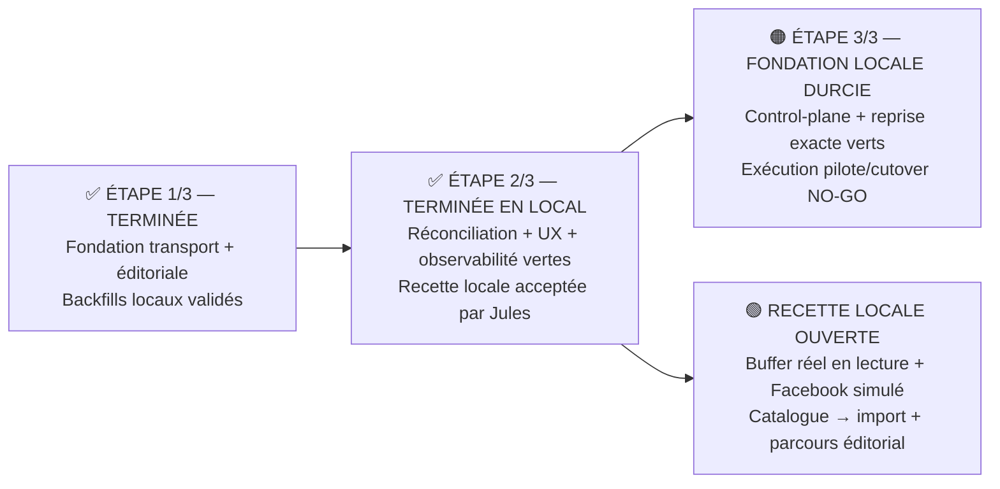

# Malikia Pulse — avancement visuel

**État au 29 août 2026 : `PULSE_LOCAL_ACCEPTANCE_READY` · `GO_BUFFER_LOCAL_DISCOVERY` · `BUFFER_LOCAL_CATALOG_LIVE_GREEN` · `BUFFER_CHANNEL_IMPORT_LOCAL_GREEN` · `BUFFER_DELIVERY_DISABLED` · `MACRO_STEP_1_COMPLETE` · `MACRO_STEP_2_LOCAL_COMPLETE` · `PROVIDER_NEUTRAL_RECONCILIATION_LOCAL_GREEN` · `PULSE_STATUS_AXES_UX_GREEN` · `PULSE_SCHEDULING_TIMEZONE_GREEN` · `PULSE_DELIVERY_OBSERVABILITY_GREEN` · `MACRO_STEP_3_LOCAL_CONTROL_PLANE_GREEN` · `MACRO_STEP_3_OPERATIONAL_NO_GO` · `BUF_P0_03_CLOSED` · `NO_GO_BUFFER_PILOT` · `NO_GO_BUFFER_PRODUCTION`**

Pulse n’est pas utilisé en production. Les données locales sont donc le périmètre validé de l’Étape 1 ; aucun clone ni inventaire d’une production inexistante n’est requis. Ce gate devra être rejoué si des données ou workers Pulse sont introduits en production avant le pilote.

La fondation locale de l’Étape 3 est prête et sa machine d’état est durcie : hold/reprise du transport exact, mesures canary obligatoires et état distinct d’attente H3. Son exécution ne peut toutefois pas commencer avant le gateway Buffer réel, les preuves owner/shadow et H2. Aucun pilote, cutover, drain ou retrait du direct n’est déclaré réalisé.

La recette manuelle locale est maintenant ouverte sur le workspace de démonstration Studio Naya : entitlement `social` actif, connexion Facebook de test active sur le transport local `direct_v1`, rôles distincts publication/approbation préparés, worker et scheduler en cours d’exécution. La publication reste simulée, mais l’écran Comptes peut désormais interroger réellement Buffer en lecture seule, afficher le compte, ses organisations et ses canaux, puis importer un canal comme cible inactive de catalogue.

## 🟢 Ce que Jules peut tester maintenant

1. Ouvrir **Croissance → Malikia Pulse** dans le workspace Studio Naya, puis vérifier le tableau de bord, le Composer, le Calendrier, l’Historique, les Automatisations et les Comptes.
2. Dans **Comptes**, cliquer **Voir mes comptes Buffer** : le compte réel, l’organisation et les canaux Instagram, LinkedIn et Facebook apparaissent sans que la clé API soit envoyée au navigateur.
3. Cliquer **Ajouter dans Buffer** pour connecter un nouveau canal dans l’interface Buffer, revenir dans Pulse puis utiliser **Resynchroniser**.
4. Cliquer **Importer dans Pulse** sur un canal sain. L’import est idempotent et reste inactif pour la publication tant que le transport Buffer n’est pas activé.
5. Avec le profil propriétaire, créer un contenu depuis un objet métier ou manuellement, le modifier, le publier immédiatement sur la connexion **Facebook — test local Pulse**, puis vérifier sa livraison simulée et son historique.
6. Avec le profil de publication Studio Naya, soumettre un autre contenu ; avec le profil d’approbation distinct, l’approuver, le planifier et vérifier son passage dans l’outbox puis le Calendrier/Historique.

**Limite volontaire :** cette recette prouve la connexion locale par clé personnelle, la découverte et l’import de canaux, ainsi que le parcours éditorial simulé. Elle ne prouve pas encore OAuth Buffer multi-utilisateur, la livraison d’un post par le runtime Buffer, le pilote fournisseur, H2 ou H3.

## ✅ Étape 1/3 — terminée

- [x] Absence d’usage Pulse en production attestée ; périmètre local accepté pour H1.
- [x] Identité transport additive et immuable : `delivery_provider`, `transport_generation`, `logical_destination_key`.
- [x] Révisions éditoriales immuables ; axes éditorial, livraison et synchronisation séparés.
- [x] Approbations et cibles liées à une révision précise ; le worker ne publie que le snapshot soumis approuvé.
- [x] Timeout, erreur réseau et HTTP 5xx ambigus conservés en `unknown`, sans retry aveugle.
- [x] Autopilot protégé par fingerprint de politique, claim DB et fencing contre les exécutions concurrentes.
- [x] Backfills avec ledger de provenance, rollback LIFO fail-closed, isolation tenant et rejeu idempotent.
- [x] Base locale : 18 posts, 18 révisions et 18 cibles migrés, 0 anomalie ; rejeu = 0 écriture.
- [x] SQLite Pulse/social : 281 tests / 2 870 assertions ; MySQL final affecté : 84 / 910 ; PHPStan : 921/921.
- [x] Social login utilisateur intact ; la fondation n’ajoute aucun binding de livraison Buffer. Le connecteur local de découverte ajouté ensuite reste séparé, lecture seule côté Buffer et sans secret frontend.

**Sortie acquise : `EDITORIAL_FOUNDATION_LOCAL_GREEN=true`.**

## ✅ Étape 2/3 — terminée en local

- [x] Découpler Facebook Data Deletion : une demande Meta visant le login ne supprime aucune connexion de diffusion directe ou Buffer ; seule la suppression complète explicitement configurée reste globale.
- [x] Valider cette frontière avec 4 tests ciblés / 39 assertions, la matrice Facebook Login + OAuth Pulse (28 / 236) et toute la suite Auth (70 / 525).
- [x] Retirer le faux kill switch mort `PULSE_ENABLED` ; les vrais switches seront ajoutés avec leurs consommateurs et resteront désactivés par défaut.
- [x] Spécifier `BUF-P0-03` : polling adaptatif tenant-scopé, arrêt sur états terminaux, respect des quotas et synchronisation manuelle ; aucune réconciliation ne peut recréer un post.
- [x] Fermer `BUF-P0-03` : Jules accepte explicitement la stratégie le 28 août 2026 ; les preuves distinctes de quota et de capacité restent dans `BUF-P0-02/10`.
- [x] Corriger la décision commerciale déjà acquise : `Free` pour le pilote borné, `Essentials` minimum recommandé en production ; préparer le dossier public DPA/API/sous-traitants sans prétendre à une validation juridique.
- [x] Ajouter l’outbox transactionnelle locale : insertion atomique avec le snapshot approuvé, payload chiffré, idempotence, claim/lease/fencing, dispatch après commit et sweeper durable.
- [x] Mettre le transport direct `direct_v1` derrière cette outbox sans dual-write ; timeout, 5xx et `429` de création sans preuve d’absence d’effet deviennent `unknown`, sans second `POST` automatique.
- [x] Supprimer l’ancien job direct devenu mort après l’attestation de zéro usage/backlog de production ; conserver uniquement son nom historique dans l’inventaire des anciennes queues.
- [x] Refuser avant toute mutation les incohérences tenant/révision/transport, expurger les erreurs opérationnelles et limiter pour l’instant l’outbox publique à l’opération `create` réellement implémentée.
- [x] Séquencer toutes les mutations d’une connexion avec la publication ; verrouiller aussi le tenant pendant une création ou une suppression complète, conserver l’historique lors d’une suppression ordinaire et ne le purger que dans la transaction de suppression complète.
- [x] Réparer durablement les agrégats terminaux après crash, traiter tout résultat invalide après le début d’un appel comme `unknown` et interdire sa supersession sans décision de réconciliation : aucun double `POST` aveugle.
- [x] Revalidation locale du lot : 173 tests / 1 804 assertions, PHPStan 926/926, Pint dirty 65/65 et gate PHP sur 127 fichiers ; aucune anomalie P0/P1 à la contre-revue finale.
- [x] Ajouter le port de lecture de statut, les DTO, le fake et le reconciler provider-neutral : scope tenant, lease/fencing, résultat hors ordre ignoré, cadence bornée, aucune méthode de création et même chemin pour la synchronisation manuelle.
- [x] Durcir la réconciliation après contre-revue : essai réservé avant lecture, plafonds absolus `unknown=3` / `sending=5`, contention sans réactivation, outbox exacte revalidée avant et après l’appel, et zéro application sur outbox absente, cross-tenant, historique ou supersédée.
- [x] Garantir la reprise de chaque mutation visible : ordre de verrous `post → cible → outbox`, marqueur de réparation réarmé atomiquement avec une outbox exacte, agrégat recalculé dans la transaction si aucune outbox n’existe, rollback complet sur échec ou crash.
- [x] Ajouter les champs de réconciliation par migration additive ; rendre `provider_post_id` write-once et invisible pour Vue ; envoyer immédiatement un `unknown` sans identité distante vers la revue opérateur, sans recherche heuristique.
- [x] Exposer uniquement les axes normalisés éditorial/livraison/synchronisation dans Composer, Calendrier et Historique ; afficher une alerte accessible « ne pas republier » pour `unknown`.
- [x] Corriger la planification : heure locale interprétée dans le fuseau IANA du tenant, stockage UTC, compatibilité des ISO avec offset et refus des heures DST inexistantes ou ambiguës.
- [x] Ajouter l’observabilité agrégée de l’outbox et de la réconciliation sans contenu, identité distante ni donnée tenant ; renforcer le filtre récursif des secrets.
- [x] Vérifier l’absence de client HTTP, OAuth/canal Buffer, binding runtime, trafic distant, faux switch et code mort introduit dans cette tranche.
- [x] Valider la tranche finale locale : 145 tests PHP / 1 359 assertions ; PHPStan 935/935 ; 380/380 tests Node et build Vite verts ; double contre-revue sans P0/P1 reproductible ; suite PHP globale laissée à Jules comme convenu.
- [x] Ouvrir la recette locale : feature `social` déjà active pour le tenant courant, compte Facebook de test connecté, droits de publication et d’approbation distincts ajoutés sans retirer les droits existants, queues `social-publish`/`social-automation` et scheduler actifs.
- [x] Revalider le parcours testable : matrice Pulse/Social 396 tests / 4 011 assertions, suite Node 380/380 et build Vite de production vert.
- [ ] Fermer les preuves fournisseur réellement nécessaires au runtime Facebook : OAuth multi-organisation, quota partagé, corrélation/timeout ambigu, matrice de statuts, cadre juridique et capacité/parcours (`BUF-P0-01/02/04/05/06/09/10`).
- [ ] Fermer les capacités produit et média nécessaires au pilote (`BUF-P0-07/08`) sans diluer l’approbation Malikia.
- [ ] Brancher le gateway Buffer concret et la réconciliation distante derrière la frontière locale déjà validée, uniquement après fermeture de leurs gates ; ne jamais exposer le schéma Buffer au domaine ou à Vue.
- [x] Ajouter une découverte locale explicitement activée par clé personnelle : compte, organisations, canaux et import idempotent, sans secret frontend ni activation de livraison.
- [x] Clôturer la recette locale sur le GO explicite de Jules du 29 août 2026.
- [ ] Ajouter OAuth Buffer multi-utilisateur et la synchronisation persistante d’un grant partagé, désactivés par défaut, après le GO d’intégration distante.
- [ ] Réaliser et figer les preuves exactes owner + shadow avant H2 ; aucune modification de mapping n’est permise après signature.
- [x] Conserver l’approbation éditoriale dans Malikia : l’outbox ne reçoit que la révision immuable déjà approuvée.
- [x] Garder la livraison Buffer structurellement inatteignable : aucun binding ni consumer de création ; seules les routes locales owner-only de catalogue/import utilisent le credential serveur. Le social login utilisateur reste hors périmètre.
- [ ] **H2 — validation humaine unique :** Jules valide les tests, l’UX et les preuves de sécurité, puis accorde ou refuse le GO pilote.

**Verdict : l’Étape 2 locale est clôturée. Le runtime Buffer réel et le pilote restent hors de cette clôture locale.**

## 🟠 Étape 3/3 — fondation locale terminée, exécution NO-GO

- [x] Ajouter un registre de cutover, des mappings et des événements par migration additive, avec FK composites tenant-scopées et audit immuable.
- [x] Exiger un mapping Facebook exact par connexion + `logical_destination_key`, une preuve shadow complète et la couverture de toutes les connexions directes actives ; lier H2 au SHA-256 déterministe du manifeste exact, jusque dans les mutations de la même seconde.
- [x] Réserver la preuve owner à l’owner/superadmin et H2/H3 à l’autorité de delivery superadmin ; conserver les acteurs par FK restrictive.
- [x] Imposer le contrat canary minimal : 10 livraisons, 168 heures, zéro `unknown`, compteurs observés non négatifs, RTO ≤ 300 secondes, preuves non futures et chronologie complète jusqu’à la fin de rollback.
- [x] Linéariser publication, hold et reprise par mutex tenant/connexion ; suspendre avant requête, ne jamais fallback automatiquement et rendre le replay convergent.
- [x] Conserver dans le hold l’état exact à reprendre ; ne réarmer que les générations encore autorisées pour les effets existants et refuser toute reprise ou tout rejeu tant qu’un effet tenant-wide `submitting` ou `unknown` reste ambigu.
- [x] Figer l’autorité superadmin au moment de H2/H3 afin qu’une évolution ultérieure du rôle ne réécrive pas l’histoire de la décision.
- [x] Exiger les résultats observés du canary — livraisons, `unknown`, RTO et preuve SHA-256 — au lieu de déduire sa réussite du seul statut.
- [x] Séparer `awaiting_h3` de `cutover_complete` : un drain prouvé n’équivaut jamais à H3, à la fin de la fenêtre de retour ou au retrait du direct.
- [x] Interdire tout effet direct après le drain, exiger le runtime candidat et le mapping figé pour H3, puis conserver un gate global séparé avant tout retrait du handler direct multi-tenant.
- [x] Rendre la readiness fail-closed : référence inconnue, cross-tenant, Buffer non mappée, identité incomplète ou doublon = blocage ; aucun drain vide ne peut être déclaré vert.
- [x] Préserver le control-plane lors d’une suppression Facebook Login ciblée et le purger uniquement dans la suppression complète tenant-scopée.
- [x] Vérifier le code mort : le transport direct reste utilisé et nécessaire au drain ; il est donc conservé. La méthode de policy et le wrapper de reprise directe devenus inutiles ont été supprimés.
- [x] Isoler les tests de migration sur leur préhistoire chronologique, sans charger des migrations futures qui dépendent précisément du schéma retiré par le scénario.
- [x] Fermer l’incident MySQL `1059` : contraintes et index explicitement nommés sous 64 caractères, état DDL partiel refusé avant écriture, récupération protégée sur les trois tables, migrations réelles `045009` et `061232` appliquées localement.
- [x] Valider le cœur local : 33 tests / 408 assertions ; matrice Social/Pulse 405 / 4 114 ; migrations sur MySQL isolé 2 / 105 ; 13 tests frontend ciblés et build Vite vert ; PHPStan 942/942 ; aucun P0/P1 reproductible aux contre-audits finaux.
- [ ] Fermer l’Étape 2 opérationnelle : gateway/OAuth/canal Buffer réels, preuves fournisseur et owner/shadow, puis **H2 par Jules**.
- [x] Implémenter avant activation la reprise opérateur d’un hold vers le même transport candidat ; aucun fallback direct automatique.
- [ ] Exécuter le pilote Facebook borné, observer le canary et prouver le RTO sur le runtime réellement déployé.
- [ ] Prouver le drain complet des jobs, références et effets ambigus legacy, puis réunir le dossier H3.
- [ ] **H3 — validation humaine unique :** Jules accorde ou refuse le GO général et le retrait du direct sur les preuves du pilote et du drain.
- [ ] Retirer seulement après H3 le code, la configuration et les secrets directs devenus prouvablement morts, sans toucher au social login utilisateur.

**Verdict : la préparation locale de l’Étape 3 est terminée. La sortie métier de l’Étape 3 reste non acquise et volontairement bloquée tant que le pilote réel, le drain et H3 ne sont pas prouvés.**
