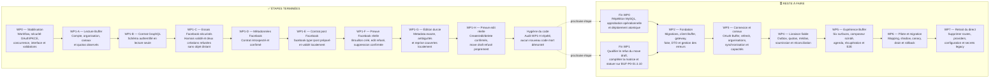

# Malikia Pulse — avancement visuel

**État au 27 août 2026 : `BLOCKED_P0`**

```mermaid
flowchart LR
    subgraph DONE["✅ ÉTAPES TERMINÉES"]
        direction TB
        D0["WP0 — Stabilisation<br/>Workflow, sécurité OAuth/PKCE,<br/>concurrence, interface et validations"]
        D1A["WP1-A — Lecture Buffer<br/>Compte, organisation, canaux<br/>et quotas observés"]
        D1B["WP1-B — Contrat GraphQL<br/>Schéma authentifié en lecture seule"]
        D1C["WP1-C — Essais Facebook sécurisés<br/>Harnais validé et deux créations refusées<br/>sans objet distant"]
        D1D["WP1-D — Métadonnées Facebook<br/>Contrat introspecté et confirmé"]
        D1E["WP1-E — Contrat post Facebook<br/>facebook.type=post préparé<br/>et validé localement"]
        D1F["WP1-F — Preuve Facebook réelle<br/>Brouillon créé, edit refusé,<br/>suppression confirmée"]
        D1G["WP1-G — Édition durcie<br/>Metadata exacte, ambiguïtés<br/>et reprise couvertes localement"]
        D1H["WP1-H — Preuve edit réelle<br/>Create/edit/delete confirmés,<br/>move draft refusé proprement"]
        DQ["Hygiène du code<br/>Audit WP1-H répété,<br/>aucun nouveau code mort démontré"]

        D0 --> D1A --> D1B --> D1C --> D1D --> D1E --> D1F --> D1G --> D1H --> DQ
    end

    subgraph TODO["⏳ RESTE À FAIRE"]
        direction TB
        T0["Fin WP0<br/>Répétition MySQL, approbation opérationnelle<br/>et déploiement atomique"]
        T1["Fin WP1<br/>Qualifier le refus du move draft,<br/>compléter la matrice et statuer sur BUF-P0-01 à 10"]
        T2["WP2 — Fondation<br/>Migrations, client Buffer, gateway,<br/>fake, DTO et gestion des erreurs"]
        T3["WP3 — Connexion et canaux<br/>OAuth Buffer, refresh, organisations,<br/>synchronisation et capacités"]
        T4["WP4 — Livraison fiable<br/>Outbox, quotas, médias,<br/>soumission et réconciliation"]
        T5["WP5 — Expérience Buffer<br/>Six surfaces, composeur scindé,<br/>agenda, récupération et E2E"]
        T6["WP6 — Pilote et migration<br/>Mapping, shadow, canary,<br/>drain et rollback"]
        T7["WP7 — Retrait du direct<br/>Supprimer routes, providers,<br/>configuration et secrets legacy"]

        T0 --> T2
        T1 --> T2
        T2 --> T3 --> T4 --> T5 --> T6 --> T7
    end

    DQ -. prochaine étape .-> T0
    DQ -. prochaine étape .-> T1
```
