# Malikia Pulse — avancement visuel

**État au 28 août 2026 : `RISK_PROPORTIONATE_VALIDATION_ACCEPTED` · `THREE_MACRO_STEPS_ACCEPTED` · `REPRESENTATIVE_CLONE_STRATEGY_ACCEPTED` · `BUFFER_SUPPORT_CONTACT_SENT` · `MACRO_STEP_1_IN_PROGRESS` · `WP2A_LOCAL_VALIDATED` · `ACCOUNT_OWNER_PAYER_CONFIRMED` · `BUFFER_COMMERCIAL_BASELINE_DOCUMENTED` · `BUFFER_LOGICAL_REQUEST_EVIDENCE_INSTRUMENTED` · `LOGICAL_DESTINATION_KEY_CONTRACT_FROZEN` · `PRE_WP2B_INVENTORY_LOCAL_VALIDATED` · `PRE_WP2B_PULSE_JOB_INVENTORY_LOCAL_VALIDATED` · `PRE_WP2B_QUEUE_SCOPE_TOOLING_VALIDATED` · `PRE_WP2B_MULTI_SCOPE_MANIFEST_LOCAL_VALIDATED` · `PRE_WP2B_MULTI_SCOPE_MATRIX_VALIDATED` · `MYSQL_COMPATIBILITY_GATE_VALIDATED` · `PR140_CI_HARDENING_IMPLEMENTED` · `PR140_CI_VALIDATED` · `WP2B_SCHEMA_GATE_PENDING` · `P0_GATES_OPEN` · `NO_GO_BUFFER_RUNTIME` · `NO_GO_BUFFER_PILOT` · `NO_GO_BUFFER_PRODUCTION`**

**Livraison : [PR #140](https://github.com/Lenenba/mlkpro_v3/pull/140) — `feature/pulse-buffer-refonte` → `develop`**

**Lot de durcissement CI couvert par la PR #140 : environnement de test protégé, couverture MySQL étendue, build déterministe et bundle initial allégé**

**Validation distante acquise pour `fdc4c146` : workflow `quality` #411 vert — `laravel-quality`, `laravel-quality-mysql` et `browser-smoke` réussis ; la PR reste ouverte, fusionnable vers `develop` et n'est pas déclarée fusionnée**

**Gate PHP global du checkpoint Étape 1 : 1 723 tests / 20 018 assertions — aucune régression détectée**

**Pilotage actif : exactement 3 macro-étapes ; l’Étape 1 est en cours. Les WP et BUF-P0 restent la traçabilité technique, pas des étapes supplémentaires.**

```mermaid
flowchart LR
    subgraph DONE["✅ PREUVES ACQUISES — TRAÇABILITÉ WP/P0"]
        direction TB
        D0["WP0 — Stabilisation<br/>Workflow, sécurité OAuth/PKCE,<br/>concurrence, interface et validations"]
        D1A["WP1-A — Lecture Buffer<br/>Compte, organisation, canaux<br/>et quotas observés"]
        D1B["WP1-B — Contrat GraphQL<br/>Schéma authentifié en lecture seule"]
        D1C["WP1-C — Essais Facebook sécurisés<br/>Harnais validé et deux créations refusées<br/>sans objet distant"]
        D1D["WP1-D — Métadonnées Facebook<br/>Contrat introspecté et confirmé"]
        D1E["WP1-E — Contrat post Facebook<br/>facebook.type=post préparé<br/>et validé localement"]
        D1F["WP1-F — Preuve Facebook réelle<br/>Brouillon créé, edit refusé,<br/>suppression confirmée"]
        D1G["WP1-G — Édition durcie<br/>Metadata exacte, ambiguïtés<br/>et reprise couvertes localement"]
        D1H["WP1-H — Preuve edit réelle<br/>Create/edit/delete confirmés,<br/>move draft refusé proprement"]
        D1I["WP1-I — Capacité par statut<br/>move@draft = frontière négative<br/>provisoire, typée et non retryable"]
        DQ["Hygiène du code<br/>Statut spéculatif et branche morte retirés,<br/>suppressions incertaines différées au clone"]
        D2["WP2-A — Contrat/fake local<br/>Port et DTO/résultat text-only,<br/>fake déterministe, 9 tests verts"]
        DI["Pré-WP2-B — Inventaire legacy<br/>CLI agrégé read-only validé<br/>2 workloads / 2 queues locales inspectés"]
        DM["Gate MySQL réel<br/>Driver vérifié, base isolée protégée,<br/>171 tests et 1 618 assertions"]
        DS["Ciblage de queue explicite<br/>Queue database renommée mesurable,<br/>queue externe identifiée sans connexion"]
        DC["BUF-P0-10 — Base commerciale<br/>Essentials recommandé côté client,<br/>question quota envoyée à Buffer"]
        DJ["BUF-P0-10 — Compteur logique local<br/>8 opérations cycle, 6 cleanup-only,<br/>redaction et erreur de verrou couvertes"]
        DV["Durcissement CI PR #140<br/>Tests DB isolés et gate MySQL étendue,<br/>build déterministe et bundle initial allégé"]
        DG["PR #140 — validations distantes<br/>quality #411 sur fdc4c146 : Laravel,<br/>MySQL et navigateur verts"]
        DE["Pré-WP2-B — manifeste v2 additif<br/>Publications + automation, failed_jobs,<br/>redaction et attestation séparée"]
        DL["Inventaire Pulse ciblé — local<br/>29 tests / 360 assertions, SQLite + MySQL<br/>2 scopes MySQL mesurables et vides"]
        DX["Gate PHP global — checkpoint courant<br/>1 723 tests et 20 018 assertions,<br/>aucune régression détectée"]

        D0 --> D1A --> D1B --> D1C --> D1D --> D1E --> D1F --> D1G --> D1H --> D1I --> DQ --> D2 --> DI --> DM --> DS --> DC --> DJ --> DV --> DG --> DE --> DL --> DX
    end

    subgraph PLAN["🎯 PILOTAGE ACTIF — EXACTEMENT 3 MACRO-ÉTAPES"]
        direction LR
        M1["🚧 ÉTAPE 1/3 — Fondation représentative<br/>EN COURS : clone et queues, puis schéma<br/>additif/backfill local réversible"]
        M2["⏸ ÉTAPE 2/3 — Runtime Facebook + UX<br/>EN ATTENTE : livraison fiable et interface,<br/>construites désactivées par défaut"]
        M3["⛔ ÉTAPE 3/3 — Pilote et cutover<br/>NO-GO : canary, drain, rollback,<br/>puis retrait prouvé du direct"]
        M1 --> M2 --> M3
    end

    DX --> M1
```

## Critères binaires et points humains

### Étape 1/3 — sortie unique : `WP2B_SCHEMA_LOCAL_GREEN=true`

- [x] Outil d’inventaire agrégé, matrice MySQL et CI validés.
- [x] Stratégie de clone pseudonymisé et validation proportionnée acceptées ; question quota multi-client envoyée à Buffer sans secret.
- [x] Relevé MySQL **local** reconfirmé : 2 scopes database mesurables (`social-automation`, `social-publish`), 0 job Pulse exact ou illisible en queue, 0 `failed_job` Pulse exact ou illisible et 0 anomalie de référence/tenant. Cette preuve n’est pas représentative et la liste des queues n’est pas attestée complète.
- [ ] Clone MySQL représentatif inventorié et preuve agrégée archivée.
- [ ] Liste complète des queues courantes, externes et anciennes attestée ; chaque scope possède une preuve.
- [ ] Chaque `failed_job` et anomalie possède une décision testée : drain, archivage, correction ou interdiction de retry.
- [x] Contrat final de `logical_destination_key` figé, avec préimage et vecteur reproductibles, sans migration.
- [ ] Plan final de backfill/rollback ajusté aux faits du clone représentatif.
- [ ] L’opérateur atteste la source représentative et la liste complète des queues ; cette attestation est une preuve, pas une revue supplémentaire.
- [ ] **H1 — unique validation humaine de l’étape 1 :** Jules accorde ou refuse `GO_WP2B_SCHEMA_LOCAL_ONLY` sur le dossier représentatif complet.
- [ ] Après H1 : migrations additives nullable, backfill `direct` / `direct_v1`, cycles SQLite/MySQL, isolation, immutabilité et rollback verts, sans binding ni trafic Buffer.

`MACRO_STEP_1_IN_PROGRESS` ne signifie pas `GO_WP2B_SCHEMA_LOCAL_ONLY`. Aucune migration ni aucun backfill n’est autorisé avant H1 ; après ce GO, le reste de l’étape 1 est tranché par ses gates automatisés.

### Étapes 2/3 et 3/3

- [ ] Étape 2 : runtime Facebook, outbox/réconciliation, UX et observabilité verts avec toutes les activations désactivées par défaut ; aucun pilote ni cutover.
- [ ] **H2 — unique validation humaine de l’étape 2 :** Jules accepte le dossier de lancement et accorde ou refuse le GO pilote.
- [ ] Étape 3 : pilote borné, canary, rollback et drain prouvés ; retrait direct seulement lorsque toute référence active et tout job legacy ont disparu.
- [ ] **H3 — unique validation humaine de l’étape 3 :** Jules accorde ou refuse le GO général et le retrait du direct sur les preuves du canary et du drain.

Le courriel Buffer a été envoyé le 28 août 2026 à 19:26 UTC via le compte Gmail connecté, sans `client_id`, token, secret, identifiant distant ni valeur `pk`. La réponse écrite reste attendue ; seul un éventuel partage du `client_id` public exigera une autorisation séparée.
