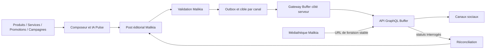

# Malikia Pulse — refonte globale Buffer-first

Date de cadrage : 2026-08-26

Statut : architecture cible recommandée, mise en production conditionnée par les gates P0

Périmètre : module tenant `social` / marque produit `Malikia Pulse`

## 1. Décision exécutive

La refonte de Malikia Pulse doit adopter **Buffer comme unique socle de diffusion vers les réseaux sociaux**.

Cette décision est pertinente parce qu'elle retire de Malikia la partie la plus coûteuse et fragile du problème :

- les applications et validations propres à chaque réseau ;
- les OAuth Facebook, Instagram, LinkedIn, X et futurs réseaux ;
- les différences de publication et de formats entre plateformes ;
- les changements fréquents d'API et de permissions ;
- la maintenance d'un transport différent pour chaque réseau.

La cible n'est cependant pas « Buffer remplace Pulse ». La cible est :

> **Malikia Pulse reste le système éditorial et métier ; Buffer devient l'unique passerelle de livraison.**

Malikia doit continuer à posséder :

- le contenu et les brouillons ;
- les préremplissages depuis Produits, Services, Promotions et Campagnes ;
- la voix de marque, les modèles, la médiathèque et l'IA ;
- les validations et permissions d'équipe ;
- le calendrier et les intentions de programmation ;
- l'Autopilot et ses règles ;
- l'historique et l'audit métier.

Buffer doit posséder :

- la connexion effective aux réseaux sociaux ;
- la normalisation des canaux sociaux ;
- la dernière étape de programmation et de publication ;
- l'adaptation aux particularités techniques des plateformes ;
- le retour d'état disponible sur la livraison.

### Recommandation finale

**GO pour une architecture Buffer-first**, sous quatre conditions avant le développement complet :

1. confirmer avec Buffer le quota adapté à une intégration SaaS multi-tenant ;
2. valider un OAuth Buffer de bout en bout avec plusieurs organisations et canaux ;
3. confirmer les possibilités de synchronisation de statut, de déduplication et de reprise ;
4. terminer la revue juridique, sécurité, confidentialité et modèle commercial.

## 2. Pourquoi le moment est favorable

Buffer a lancé sa nouvelle API publique GraphQL le 27 mai 2026. Elle est disponible sur tous les plans et Buffer indique que son OAuth est géré pour les applications tierces. L'API permet notamment de créer, programmer, modifier et récupérer les publications et canaux. Elle couvre les quatre réseaux déjà visés par Pulse et plusieurs autres.

Sources officielles :

- [Annonce de la nouvelle API publique Buffer](https://buffer.com/resources/buffer-api-is-here/)
- [Présentation et limites actuelles de l'API Buffer](https://support.buffer.com/en-us/articles/what-is-buffers-api-GtIYIQilz5)
- [Documentation développeur Buffer](https://developers.buffer.com/)

Cette API est récente. C'est une opportunité, mais aussi une raison de conserver une couche d'adaptation interne et de ne pas coupler le domaine Malikia directement au schéma GraphQL de Buffer.

Une règle est non négociable : **utiliser uniquement la nouvelle API GraphQL `https://api.buffer.com`, jamais l'ancienne API REST**.

## 3. Positionnement produit cible

### Promesse simple

> Créer, valider, planifier et diffuser la communication sociale d'une entreprise à partir de ses vraies données Malikia, sans gérer les contraintes techniques de chaque réseau.

### Ce qui différencie Malikia Pulse de Buffer

Buffer sait distribuer du contenu. Malikia connaît l'entreprise.

Pulse dispose déjà des sources métier qui rendent le produit distinctif :

- produits et services ;
- promotions ;
- campagnes ;
- contexte sectoriel ;
- voix de marque ;
- rôles et validations internes ;
- automatisations liées à l'activité de l'entreprise.

La refonte doit amplifier cette différence. Elle ne doit pas reconstruire une copie du tableau de bord Buffer.

### Ce qui reste hors scope

Pour la première version Buffer-first, Pulse n'est pas :

- une boîte de réception de commentaires et messages ;
- un outil complet de community management ;
- une plateforme d'analytics sociaux avancés ;
- un remplaçant de l'interface Buffer pour administrer les comptes sociaux ;
- une solution de connexion utilisateur à Malikia.

L'API publique Buffer ne permet actuellement pas de lire ou répondre aux commentaires. Ses métriques sont annoncées comme expérimentales et non recommandées pour une application tierce de production. Les analytics audience/engagement ne doivent donc pas être promis dans le MVP.

## 4. État actuel du dépôt

### 4.1 Socle fonctionnel à préserver

Le module est activé par la feature tenant `social` et protégé par les permissions :

- `social.view` ;
- `social.manage` ;
- `social.publish` ;
- `social.approve`.

Les fonctionnalités métier déjà présentes comprennent :

- vue d'ensemble ;
- composeur ;
- calendrier éditorial ;
- voix de marque ;
- médiathèque ;
- campagnes Pulse ;
- modèles ;
- historique ;
- Autopilot ;
- boîte de validation ;
- connexions de comptes.

Le préremplissage depuis `product`, `service`, `promotion` et `campaign` constitue une valeur centrale à conserver.

### 4.2 Utilisateurs et besoins à servir

| Profil | Besoin principal | Règle d'accès |
| --- | --- | --- |
| Owner | Connecter Buffer, choisir les canaux, contrôler la diffusion | Accès complet au tenant |
| Éditeur | Créer, adapter et programmer du contenu | `social.manage` et/ou `social.publish` selon l'action |
| Approbateur | Réviser, approuver ou rejeter avant diffusion | `social.approve` |
| Lecteur | Suivre le calendrier et l'historique | `social.view` |

Les quatre permissions actuelles restent la base de la refonte. De nouveaux droits comme `social.automate` ou `social.analytics` ne doivent être ajoutés que lorsqu'ils protègent une action réellement distincte et avec une migration RBAC explicite.

Le module `social` est aujourd'hui activé seulement dans certains plans. L'intégration Buffer ajoute aussi les limites du plan Buffer appartenant au client. La phase P0 doit donc définir séparément :

- l'accès commercial au module Pulse dans Malikia ;
- les quotas Malikia de contenu, IA et automatisation ;
- les canaux et appels disponibles dans le plan Buffer du client ;
- le comportement d'upgrade lorsque l'un des deux produits atteint sa limite.

### 4.3 Modèle de domaine actuel

Le cœur repose notamment sur :

- `SocialAccountConnection` ;
- `SocialPost` ;
- `SocialPostTarget` ;
- `SocialPostTemplate` ;
- `SocialApprovalRequest` ;
- `SocialAutomationRule` et `SocialAutomationRun` ;
- `SocialMediaAsset`.

Le choix « un post global, une cible par canal » est sain et doit rester. Il permet de suivre les succès et échecs partiels par destination.

### 4.4 Couche directe à remplacer

La couche actuelle comprend :

- `PlatformPublisherInterface` ;
- `SocialProviderRegistry` ;
- `AbstractPlatformPublisher` ;
- `AbstractOauthPlatformPublisher` ;
- `FacebookPagePlatformPublisher` ;
- `InstagramBusinessPlatformPublisher` ;
- `LinkedInPagePlatformPublisher` ;
- `XProfilePlatformPublisher` ;
- les blocs `services.social.*` de `config/services.php` ;
- le callback OAuth public par plateforme ;
- la logique de token, refresh et test par réseau dans `SocialAccountConnectionService`.

L'audit du code montre que cette couche est encore principalement un scaffold : les quatre publishers utilisent le même POST générique vers une URL configurée, sans modéliser les vrais workflows propres aux réseaux ni découvrir les pages, organisations ou profils disponibles. La remplacer maintenant évite d'investir davantage dans une direction coûteuse.

### 4.5 Dette à corriger pendant la refonte

- Les statuts éditoriaux et les statuts de livraison sont mélangés.
- Un brouillon simplement daté peut déjà être considéré comme `scheduled`.
- Le job de publication capture les exceptions, ce qui empêche les retries de file de jouer pleinement leur rôle.
- Il n'existe pas de verrou ou clé d'idempotence garantissant l'absence de double publication.
- Il n'existe pas de réconciliation distante des statuts.
- Certains dispatchs se font dans une transaction sans `afterCommit`.
- Les routes web et API ne présentent pas exactement le même contrat.
- Plusieurs contrôleurs répètent la résolution des droits.
- Le frontend contient de grands composants monolithiques et des appels Axios répétés sans client Pulse central.

## 5. Ce que Buffer permet et ce qu'il ne permet pas encore

### 5.1 Capacités utiles

La nouvelle API Buffer permet actuellement :

- OAuth 2.0 Authorization Code avec PKCE ;
- récupération des organisations et canaux ;
- création et modification de publications ;
- publication immédiate avec `shareNow` ;
- programmation exacte avec `customScheduled` et `dueAt` ;
- ajout à la prochaine plage Buffer avec `addToQueue` ;
- lecture des publications programmées et envoyées ;
- images et vidéos fournies par URL publique ;
- paramètres spécifiques à plusieurs plateformes ;
- brouillons et politiques d'approbation Buffer selon le compte.

Réseaux annoncés par l'API : Instagram, Threads, LinkedIn, X, Facebook, TikTok, Google Business Profile, Mastodon, YouTube, Pinterest et Bluesky.

Références :

- [Authentification OAuth Buffer](https://developers.buffer.com/guides/authentication.html)
- [Publications et programmation](https://developers.buffer.com/guides/posts-and-scheduling.html)
- [Référence GraphQL](https://developers.buffer.com/reference.html)

### 5.2 Contraintes structurantes

#### Analytics

L'API ne fournit pas encore un accès complet et fiable aux analytics pour les applications OAuth tierces. Pulse doit afficher uniquement des indicateurs opérationnels réellement maîtrisés :

- brouillons ;
- à valider ;
- programmés ;
- envoyés ;
- en erreur ;
- canaux connectés ;
- régularité du planning.

Les impressions, portée, clics et engagement ne doivent pas être simulés. Une action « Ouvrir les analyses dans Buffer » peut être proposée.

#### Engagement

La lecture et la réponse aux commentaires ne sont pas disponibles via l'API publique. Cette fonction reste hors scope ou renvoie vers Buffer.

#### Médias

Buffer ne propose pas d'upload média natif via cette API. Le fichier doit être disponible à une URL :

- HTTPS ;
- directe ;
- publique sans authentification ;
- stable jusqu'à la publication.

Les URL signées à courte durée peuvent provoquer l'échec d'une publication planifiée. La médiathèque Malikia doit donc produire une URL de livraison dédiée, non devinable, stable et soumise à une politique de rétention explicite.

Référence : [Hébergement des médias pour l'API Buffer](https://developers.buffer.com/guides/hosting-media.html).

#### Quotas

Les limites documentées par client sont :

| Plan Buffer | 15 minutes | 24 heures | 30 jours |
| --- | ---: | ---: | ---: |
| Free | 100 | 250 | 3 000 |
| Essentials | 100 | 250 | 7 500 |
| Team | 100 | 500 | 15 000 |

Ces valeurs sont trop importantes pour être laissées comme détail d'implémentation. Pulse devra :

- lire les headers `RateLimit` et `RateLimit-Policy` ;
- respecter `Retry-After` sur HTTP 429 ;
- suivre un budget par client et par fenêtre ;
- regrouper et paginer les synchronisations ;
- éviter le polling agressif ;
- obtenir de Buffer une limite adaptée à une intégration multi-tenant avant le lancement général.

Référence : [Limites de l'API Buffer](https://developers.buffer.com/guides/api-limits.html).

#### Erreurs GraphQL

Les erreurs fonctionnelles ou système peuvent être renvoyées dans le corps d'une réponse HTTP 200. Le client doit inspecter à la fois :

- les unions de mutation, dont `MutationError` ;
- le tableau GraphQL de premier niveau `errors` ;
- le statut HTTP, notamment 401 et 429.

Référence : [Gestion des erreurs Buffer](https://developers.buffer.com/guides/error-handling.html).

#### Webhooks et idempotence distants

Aucun contrat public de webhook ou de clé d'idempotence n'a été identifié dans la documentation examinée le 26 août 2026. Ce point doit être confirmé avec Buffer. Tant qu'il ne l'est pas, l'architecture doit utiliser :

- une idempotence locale ;
- une outbox de livraison ;
- une réconciliation par polling maîtrisé ;
- une action manuelle « Resynchroniser ».

## 6. Principe d'architecture



### Règles d'autorité

| Domaine | Système de référence |
| --- | --- |
| Contenu, variantes, source métier | Malikia |
| Voix de marque, modèles, IA | Malikia |
| Validation et permissions | Malikia |
| Intention de date et calendrier éditorial | Malikia |
| Connexion technique aux réseaux | Buffer |
| Canaux accessibles | Buffer, cache normalisé dans Malikia |
| Livraison finale | Buffer |
| Historique métier et audit | Malikia |
| État distant de livraison | Buffer, réconcilié dans Malikia |
| Engagement et analytics avancés | Buffer tant que l'API publique ne les expose pas correctement |

### Buffer-first, pas dépendance diffuse

Le navigateur ne doit jamais appeler Buffer et ne doit jamais recevoir ses tokens. Toutes les communications passent par le serveur Malikia.

Une interface interne doit isoler le fournisseur, même si Buffer est le seul fournisseur de production :

```php
interface SocialDistributionGateway
{
    public function syncChannels(SocialProviderConnection $connection): array;
    public function publishNow(SocialPostTarget $target): DistributionResult;
    public function schedule(SocialPostTarget $target): DistributionResult;
    public function update(SocialPostTarget $target): DistributionResult;
    public function cancel(SocialPostTarget $target): DistributionResult;
    public function status(SocialPostTarget $target): DistributionStatus;
}
```

Une seule implémentation est prévue : `BufferDistributionGateway`. Cette abstraction n'a pas pour but de maintenir d'autres réseaux directs ; elle empêche le domaine, les contrôleurs et le frontend de devenir dépendants du schéma Buffer.

## 7. Modèle de données cible

Les migrations doivent être additives. Les migrations historiques déjà exécutées ne doivent jamais être supprimées ou réécrites.

### 7.1 Nouvelle table `social_provider_connections`

Une connexion représente l'autorisation Buffer d'un tenant, pas un réseau individuel.

Champs recommandés :

- `id` ;
- `user_id` owner/tenant ;
- `provider` avec valeur `buffer` ;
- `external_account_id` ;
- `external_organization_id` sélectionné ;
- `display_name` ;
- `credentials` chiffrés ;
- `granted_scopes` ;
- `status` ;
- `token_expires_at` ;
- `connected_at` ;
- `last_synced_at` ;
- `last_error_code` et `last_error_message` ;
- `metadata` ;
- timestamps.

Le modèle doit pouvoir supporter plusieurs connexions plus tard, mais l'UX V1 peut limiter un tenant à une connexion Buffer active.

Le tenant sélectionne explicitement une organisation Buffer autorisée. Même si le token permet d'en voir plusieurs, toutes les opérations Malikia doivent rester enfermées dans l'organisation sélectionnée.

### 7.2 Réutilisation de `social_account_connections` comme cache de canaux

La table actuelle devient la représentation locale des canaux Buffer synchronisés.

Ajouts recommandés :

- `social_provider_connection_id` ;
- `provider = buffer` ;
- `external_account_id` = identifiant du canal Buffer ;
- `platform` = réseau réel, par exemple `instagram` ou `linkedin` ;
- `channel_type` ;
- `avatar_url` ;
- `timezone` ;
- `capabilities` ;
- `provider_status` ;
- `is_disconnected` ;
- `is_locked` ;
- `is_queue_paused` ;
- `last_synced_at` ;
- `metadata`.

Les credentials ne doivent plus être répétés sur chaque canal.

### 7.3 Évolution de `social_post_targets`

Une cible reste associée à un canal local et reçoit :

- `provider = buffer` ;
- `provider_post_id` ;
- `idempotency_key` unique ;
- `editorial_revision` ou hash du payload ;
- `delivery_status` ;
- `provider_status` ;
- `submitted_at` ;
- `remote_scheduled_for` ;
- `last_synced_at` ;
- `provider_error_code` ;
- `provider_error_message` ;
- `metadata`.

Le couple logique `(social_post_target_id, editorial_revision)` ne doit être envoyé qu'une fois. Un retry doit retrouver le résultat existant ou réconcilier avant de recréer une publication.

### 7.4 Ajouter des variantes par réseau

Le contenu actuel est global : le même texte, le même média et le même lien sont envoyés à toutes les cibles. Or Buffer crée une publication distincte par canal et expose des métadonnées propres aux réseaux.

Le modèle cible doit conserver un contenu de base simple, puis autoriser une surcharge facultative par réseau ou canal :

- texte et hashtags ;
- média et format ;
- lien et premier commentaire ;
- type Instagram, thread ou métadonnées propres au réseau ;
- résultat de validation des capacités.

Une table `social_post_variants` ou une structure équivalente normalisée est préférable à l'enfouissement de toutes les variantes dans les métadonnées de cible. Une variante absente hérite du contenu de base. Le composeur peut ainsi rester simple par défaut et afficher « Adapter par réseau » en divulgation progressive.

### 7.5 Séparer les statuts

Le statut unique actuel doit évoluer vers trois axes :

- `editorial_status` : `draft`, `pending_approval`, `approved`, `rejected`, `archived` ;
- `delivery_status` : `not_submitted`, `queued`, `submitted`, `scheduled`, `publishing`, `published`, `partial_failed`, `failed`, `canceled` ;
- `sync_status` : `pending`, `synced`, `error`, `reconnect_required`.

`scheduled_for` représente toujours l'intention Malikia. `remote_scheduled_for` représente ce que Buffer a accepté.

## 8. Parcours fonctionnels cibles

### 8.1 Onboarding Buffer

1. L'owner clique sur « Connecter Buffer ».
2. Malikia lance OAuth Buffer Authorization Code + PKCE.
3. Le callback vérifie `state`, échange le code et chiffre les tokens.
4. L'owner choisit l'organisation Buffer si plusieurs sont disponibles.
5. Malikia synchronise les canaux.
6. L'owner active les canaux utilisables dans Pulse.
7. Un diagnostic affiche canaux prêts, déconnectés, verrouillés ou en pause.

Scopes initiaux recommandés selon le principe du moindre privilège :

- `account:read` ;
- `posts:read` ;
- `posts:write` ;
- `offline_access`.

Ne pas demander `account:write` ni les scopes `ideas:*` tant qu'une fonctionnalité Pulse ne les utilise pas.

Les access tokens expirent rapidement et les refresh tokens Buffer sont à rotation unique. Le refresh doit donc être protégé par un verrou distribué et enregistrer atomiquement le nouveau couple de tokens. Deux refreshs concurrents peuvent sinon révoquer la connexion.

### 8.2 Création et validation

1. Pulse crée et sauvegarde le contenu localement.
2. Les variantes par canal sont validées contre les capacités mises en cache.
3. Le workflow `social.approve` reste entièrement dans Malikia.
4. Aucun post non approuvé n'est envoyé comme publication active à Buffer.
5. Après approbation, une entrée d'outbox est créée après commit.

Cette stratégie évite d'avoir deux systèmes d'approbation concurrents et n'impose pas le plan Team de Buffer pour utiliser le workflow d'équipe Malikia.

### 8.3 Publication immédiate

- Une cible est créée par canal.
- Le gateway appelle `createPost` avec `mode: shareNow`.
- L'identifiant Buffer est persisté avant toute nouvelle tentative.
- La cible devient `submitted`, pas immédiatement `published`.
- La réconciliation confirme ensuite `sent` ou `error`.

### 8.4 Programmation

- Malikia conserve la date locale et son fuseau.
- L'heure est convertie en UTC et envoyée avec `mode: customScheduled` et `dueAt`.
- Buffer reçoit le post dès l'approbation ; Laravel ne garde pas un job dormant jusqu'à la date finale.
- La date acceptée par Buffer est stockée dans `remote_scheduled_for`.
- Toute différence est visible comme conflit de synchronisation.

Une option distincte « Prochaine plage disponible » pourra utiliser `addToQueue`. Elle ne doit jamais remplacer silencieusement une date exacte choisie par l'utilisateur.

### 8.5 Modification ou annulation

Une modification après soumission doit :

- verrouiller la révision locale ;
- mettre à jour ou annuler la publication Buffer selon son état ;
- enregistrer l'ancien et le nouveau payload dans l'audit ;
- réconcilier l'état final ;
- expliquer clairement si le post est déjà trop avancé pour être modifié.

### 8.6 Mode dégradé

Si Buffer est indisponible ou le quota presque épuisé :

- Pulse continue à créer, modifier et valider les brouillons ;
- les livraisons restent dans l'outbox locale ;
- l'utilisateur voit « En attente de synchronisation » ;
- aucun fallback vers les APIs sociales directes n'est exécuté ;
- les retries respectent le backoff et `Retry-After` ;
- une alerte opérationnelle est déclenchée.

## 9. Refonte de l'expérience utilisateur

Le frontend Pulse contient actuellement onze entrées principales. La refonte doit les ramener à six surfaces orientées tâches :

1. **Aperçu** — état Buffer, couverture du planning, à valider, programmés, envoyés, erreurs ;
2. **Publications** — brouillons, validation, programmées, publiées, erreurs ;
3. **Créer** — composeur, avec Campagne et Autopilot comme modes avancés ;
4. **Calendrier** — intentions Malikia et état de synchronisation Buffer ;
5. **Bibliothèque** — modèles, médias et voix de marque ;
6. **Canaux & Buffer** — connexion, organisation, synchronisation et activation des canaux.

Une entrée **Analyses** ne sera ajoutée que lorsque les données sont réellement disponibles par API. Avant cela, l'Aperçu propose un lien vers Buffer.

### Principes UX

- un seul bouton « Connecter Buffer », pas quatre OAuth réseaux ;
- les logos des réseaux restent visibles pour choisir les canaux ;
- aucun token, scope brut ou identifiant technique n'est exposé dans l'interface normale ;
- l'état éditorial et l'état de livraison sont affichés séparément ;
- les erreurs indiquent l'action possible : resynchroniser, reconnecter, corriger le média ou réessayer ;
- la prévisualisation reste proche du formulaire, sticky sur desktop et accessible par tiroir sur mobile ;
- le calendrier mobile devient une vue agenda, pas une grille mensuelle de 42 cellules en colonne ;
- les capacités et limites de format viennent du DTO serveur, pas de tableaux codés en dur dans Vue ;
- une copie de base peut être adaptée par réseau sans obliger l'utilisateur à tout réécrire ;
- les confirmations utilisent la modale commune, pas `window.confirm` ;
- notices, badges, cartes et états vides utilisent les composants UI partagés.

### DTO frontend de canal

Le frontend reçoit un contrat stable indépendant de Buffer :

```text
id, network, name, handle, avatar_url, timezone,
capabilities, active, connection_status, sync_status, last_synced_at
```

Il ne reçoit jamais de credentials Buffer.

### Découpage des composants

`SocialPostComposer.vue`, `SocialAutomationManager.vue` et `SocialAccountManager.vue` sont aujourd'hui très volumineux. La refonte doit les scinder au minimum en :

- `PulseComposerForm` ;
- `PulseChannelPicker` ;
- `PulseSchedulePanel` ;
- `PulseComposerActions` ;
- `PulsePostPreview` ;
- `PulseSuggestionsPanel` ;
- `BufferConnectionCard` ;
- `BufferChannelList` ;
- `PulseDeliveryStatus`.

Un client/composable Pulse unique doit centraliser les appels, erreurs, rafraîchissements et normalisations.

## 10. Inventaire de conservation, transformation et retrait

| Élément | Décision | Commentaire |
| --- | --- | --- |
| Feature tenant `social` | Conserver | Gouvernance du module |
| Permissions `social.*` | Conserver | Workflow Malikia indépendant du plan Buffer |
| `SocialPost` | Conserver et faire évoluer | Source de vérité éditoriale |
| `SocialPostTarget` | Conserver et faire évoluer | Une cible par canal Buffer |
| Approbations | Conserver | Une seule autorité : Malikia |
| Autopilot | Conserver | Buffer intervient seulement à la livraison |
| Voix de marque, modèles, IA | Conserver | Différenciation produit |
| Médiathèque | Conserver et adapter | URL de livraison stable requise |
| Calendrier et historique | Conserver | Ajouter synchronisation et conflits |
| Préfill métier | Conserver absolument | Différenciateur principal |
| `SocialPlatformLogo` et preview | Conserver et généraliser | Capacités pilotées par le serveur |
| `SocialAccountConnection` | Transformer | Devient un canal Buffer cache local |
| `SocialProviderRegistry` | Remplacer | Devient registry de capacités, pas publishers directs |
| `SocialPublishingService` | Refactorer | Orchestrateur outbox + gateway Buffer |
| `PublishSocialPostTargetJob` | Remplacer | Soumission idempotente + réconciliation |
| OAuth Facebook/Instagram/LinkedIn/X de Pulse | Retirer après migration | Remplacé par un OAuth Buffer |
| Publishers directs | Retirer après migration | Aucun fallback direct |
| Config/env `SOCIAL_*` de publication directe | Retirer après fenêtre de retour | Révoquer aussi les secrets fournisseurs |
| Tests publishers/OAuth directs | Réécrire | Contrats Buffer fake et HTTP |

### Ne surtout pas supprimer

`UserSocialAccount`, `Auth\SocialAuthController`, `SocialAuthButtons.vue`, `config/social_auth.php` et les providers Google/Microsoft/Facebook/LinkedIn utilisés pour **se connecter à Malikia** ne font pas partie du transport Pulse.

La refonte Buffer ne doit pas casser le login social. Le service de suppression de données Facebook doit aussi être découplé des connexions de publication Pulse.

## 11. Architecture backend recommandée

### Services

- `SocialDistributionGateway` ;
- `BufferDistributionGateway` ;
- `BufferGraphqlClient` ;
- `BufferOauthService` ;
- `BufferTokenService` avec verrou de refresh ;
- `BufferChannelSynchronizer` ;
- `BufferPostMapper` ;
- `BufferErrorMapper` ;
- `SocialDeliveryOutboxService` ;
- `SocialDeliveryReconciler` ;
- `SocialChannelCapabilityService` ;
- `SocialMediaDeliveryUrlService`.

### Jobs

- `SyncBufferChannelsJob` ;
- `SubmitBufferPostTargetJob` ;
- `ReconcileBufferPostTargetJob` ;
- `ReconcileBufferOrganizationJob` ;
- `RefreshBufferConnectionTokenJob` si nécessaire.

Les jobs doivent :

- être dispatchés `afterCommit` ;
- utiliser un verrou par cible ou connexion ;
- être idempotents ;
- laisser remonter les exceptions retryables ;
- distinguer erreur utilisateur, reconnexion, rate limit et panne fournisseur ;
- journaliser sans contenu sensible ni token.

### Routes

Conserver autant que possible les routes produit `/social/...` pour limiter la casse. Remplacer les routes de comptes directs par des actions métier :

- connecter Buffer ;
- callback Buffer ;
- choisir une organisation ;
- synchroniser les canaux ;
- activer/désactiver un canal ;
- reconnecter ou déconnecter Buffer ;
- consulter le diagnostic de synchronisation.

Les routes web et API doivent utiliser les mêmes actions applicatives et DTO, avec Policies dédiées au lieu de répéter `resolveAccess` dans chaque contrôleur.

## 12. Sécurité, confidentialité et juridique

### Sécurité technique

- OAuth Authorization Code + PKCE obligatoire ;
- `state` fort, à usage unique et expirant ;
- client secret uniquement côté serveur ;
- access et refresh tokens chiffrés au repos ;
- refresh atomique et verrouillé ;
- scopes minimaux ;
- isolation stricte par owner/tenant et organisation Buffer sélectionnée ;
- rotation et révocation documentées ;
- aucun token dans les logs, exceptions, payloads Inertia ou analytics ;
- audit de toutes les connexions, soumissions, annulations et reconnexions ;
- suppression et export des données documentés.

### Revue fournisseur obligatoire

Les [conditions API Buffer](https://buffer.com/legal) ont été mises à jour le 5 août 2026. Avant le lancement général, Malikia doit valider :

- l'usage autorisé pour une application SaaS multi-tenant ;
- le DPA et le rôle de Buffer comme sous-traitant ;
- la politique de rétention du contenu ;
- les exigences de notification d'incident ;
- les clauses de disponibilité, suspension et évolution de l'API ;
- les règles de marque et la formulation « s'intègre à Buffer » ;
- les mentions à ajouter aux conditions et à la politique de confidentialité Malikia.

Les conditions prévoient notamment une notification rapide à Buffer, au plus tard sous 24 heures, en cas d'incident affectant les clés, secrets ou données d'utilisateurs Buffer. Le runbook d'incident Malikia doit l'intégrer.

## 13. Modèle commercial recommandé

Pour le MVP :

- le client possède son compte Buffer ;
- le client connecte ses réseaux dans Buffer ;
- Malikia se connecte au compte Buffer par OAuth ;
- Malikia ne revend pas de siège Buffer ;
- le coût et les limites du plan Buffer sont transparents dans l'onboarding.

Cette approche isole mieux les tenants et évite de placer tous les réseaux de tous les clients dans une organisation Buffer contrôlée par Malikia.

Une offre Buffer incluse ou gérée par Malikia ne doit être envisagée qu'après un accord commercial spécifique couvrant quotas, support, facturation, données et séparation des clients.

## 14. Observabilité et exploitation

### Données à suivre

- connexion Buffer active/reconnexion requise ;
- canaux actifs, déconnectés, verrouillés ou en pause ;
- âge de la dernière synchronisation ;
- taille et âge de l'outbox ;
- soumissions acceptées/refusées ;
- temps entre approbation et acceptation Buffer ;
- publications bloquées en `submitted` ou `publishing` ;
- taux d'échec par réseau et code ;
- quotas restants pour 15 minutes, 24 heures et 30 jours ;
- nombre de retries et réconciliations ;
- écarts entre `scheduled_for` et `remote_scheduled_for` ;
- doublons détectés ou empêchés.

### Alertes minimales

- quota restant sous 20 %, puis 10 % ;
- plusieurs 401 ou reconnexions requises ;
- plusieurs 429 ;
- outbox la plus ancienne au-delà du seuil ;
- réconciliation en retard ;
- hausse des erreurs `UNEXPECTED` ;
- média inaccessible ;
- publication distante sans mapping local ou inversement.

### Runbooks requis

- Buffer indisponible ;
- quota épuisé ;
- refresh token révoqué ;
- média inaccessible ;
- post bloqué ou dupliqué ;
- organisation/canal supprimé ;
- rollback du cutover ;
- incident de sécurité fournisseur.

## 15. Stratégie de migration sans double publication

### Principe

Les anciens tokens sociaux ne peuvent pas être transférés automatiquement à Buffer. Chaque tenant doit connecter Buffer et sélectionner ses canaux.

### Étapes

1. **Inventorier** les connexions directes, publications futures, règles Autopilot, modèles et historiques.
2. **Geler** la création de nouvelles connexions directes derrière un feature flag.
3. **Déployer** la connexion Buffer et la synchronisation de canaux en lecture seule.
4. **Créer une correspondance** `legacy_connection_id -> buffer_channel_id` validée par l'owner.
5. **Remapper** les références actives :
   - `social_automation_rules.target_connection_ids` ;
   - `social_post_templates.metadata.selected_target_connection_ids` ;
   - les snapshots associés ;
   - les nouveaux brouillons et publications futures.
6. **Conserver** les anciennes cibles publiées et leurs connexions legacy en lecture seule pour l'historique.
7. **Traiter les posts déjà programmés** avec une stratégie de drain :
   - aucun nouveau post ne part par le transport direct après le cutover ;
   - les posts legacy déjà en file terminent sur l'ancien transport pendant une courte fenêtre ;
   - ils ne sont pas recréés dans Buffer sans annulation et réconciliation explicites ;
   - un registre de cutover empêche qu'une même cible parte par les deux transports.
8. **Basculer** chaque tenant sous feature flag `buffer` après une publication test réussie.
9. **Révoquer** les tokens et secrets directs après la fenêtre de retour.
10. **Supprimer** le code et la configuration directs seulement lorsque tous les tenants et posts actifs sont migrés ou drainés.

### Feature flags suggérés

- `social_buffer_connection_enabled` ;
- `social_buffer_delivery_enabled` ;
- `social_direct_connections_read_only` ;
- `social_direct_delivery_disabled` ;
- `social_buffer_reconciliation_enabled`.

Le rollback remet la soumission Buffer en pause et conserve les brouillons/outbox locaux. Il ne réactive pas automatiquement la publication directe sans décision opérateur, afin d'éviter les doublons.

## 16. Plan de livraison

### Phase P0 — preuve et décision finale

Livrables :

- client OAuth Buffer enregistré ;
- spike serveur GraphQL ;
- connexion à deux organisations de test ;
- synchronisation de plusieurs canaux ;
- publication texte, image, immédiate et planifiée ;
- lecture des statuts `scheduled`, `sent` et `error` ;
- test de révocation et refresh concurrent ;
- test des limites et erreurs GraphQL ;
- confirmation écrite de Buffer sur quotas SaaS, webhooks et idempotence ;
- revue juridique/sécurité ;
- décision sur le modèle commercial.

Sortie : GO, GO conditionnel ou NO-GO documenté.

### Phase P1 — fondation Buffer

- migrations additives ;
- `BufferGraphqlClient` ;
- OAuth PKCE, chiffrement et refresh lock ;
- connexion provider distincte des canaux ;
- synchronisation et cache de capacités ;
- fake Buffer déterministe pour tests et démos ;
- observabilité quotas/erreurs.

### Phase P2 — Canaux & Buffer

- nouvel onboarding ;
- choix organisation ;
- liste et activation des canaux ;
- diagnostic, reconnexion et synchronisation ;
- retrait de l'UX OAuth par réseau ;
- DTO frontend stable.

### Phase P3 — livraison fiable

- outbox ;
- publication `shareNow` ;
- programmation `customScheduled` ;
- idempotence, locks et retries ;
- URLs média stables ;
- réconciliation des statuts ;
- conflits de date et mode dégradé ;
- cockpit opérationnel.

### Phase P4 — refonte UX globale

- navigation à six surfaces ;
- page Publications unifiée ;
- composeur scindé ;
- calendrier desktop/mobile ;
- Bibliothèque unifiée ;
- badges éditoriaux/livraison/sync ;
- accessibilité, responsive et cohérence visuelle.

### Phase P5 — migration pilote puis générale

- migration d'un tenant interne/démo ;
- canary de quelques tenants ;
- mapping assisté des canaux ;
- remap modèles et Autopilot ;
- drain des programmations legacy ;
- suivi d'erreurs et support ;
- généralisation progressive.

### Phase P6 — retrait de la couche directe

- suppression des publishers directs ;
- suppression du callback par réseau ;
- retrait des variables et secrets directs ;
- révocation fournisseur ;
- réécriture finale des tests ;
- mise à jour des anciennes documentations techniques ;
- conservation des données historiques en lecture seule.

### Phase ultérieure

- analytics natifs uniquement si l'API Buffer devient fiable pour OAuth tiers ;
- engagement uniquement si une API publique le permet ;
- nouvelles plateformes selon la matrice de capacités ;
- intégration éventuelle des idées Buffer si elle apporte une valeur nette ;
- accord commercial Buffer approfondi si Malikia veut inclure le service.

## 17. Stratégie de tests

### Tests unitaires

- sérialisation des requêtes GraphQL ;
- mapping des canaux et capacités ;
- mapping des statuts ;
- erreurs de mutation et erreurs GraphQL globales ;
- calcul et lecture des quotas ;
- rotation de refresh token ;
- génération des clés d'idempotence ;
- règles de variante par réseau ;
- génération d'URL média de livraison.

### Tests Feature Laravel

- OAuth state/PKCE et isolation tenant ;
- sélection d'organisation ;
- pagination et déduplication des canaux ;
- publication immédiate et planifiée ;
- approbation locale avant Buffer ;
- échecs partiels multi-canaux ;
- retry sans double envoi ;
- 401, 429, timeout et `UNEXPECTED` ;
- reconnexion requise ;
- réconciliation d'événements hors ordre ;
- modification/annulation ;
- média inaccessible ;
- permissions `social.*` ;
- migration des JSON Autopilot et modèles ;
- drain des publications legacy ;
- aucune requête réseau dans les scénarios de démo.

### Tests frontend et E2E

- `PulseChannelPicker` selon capacités ;
- distinction statut éditorial/livraison/sync ;
- erreurs et actions de récupération ;
- fuseaux et reprogrammation ;
- responsive du composeur et du calendrier ;
- parcours Playwright : connecter Buffer -> choisir organisation -> synchroniser -> créer -> valider -> programmer -> réconcilier ;
- parcours reconnexion et mode dégradé.

### Tests à préserver

Les suites relatives au composeur, historique, calendrier, approbations, modèles, préfill, suggestions, voix de marque, médias, campagnes et Autopilot doivent rester. Les suites OAuth et publishers directs sont remplacées par les contrats Buffer.

Les tests `Auth/Social*` liés à la connexion à Malikia restent hors périmètre et ne doivent pas être supprimés.

## 18. Démos, internationalisation et accessibilité

### Démos

Les scénarios de démonstration ne doivent jamais appeler Buffer ou un réseau réel.

- Studio Naya contient actuellement un faux compte Instagram déconnecté et quelques posts/templates. Il devra être migré vers une connexion Buffer factice, plusieurs canaux, une validation et au moins un échec récupérable.
- Le scénario Boréal Propreté n'alimente pas encore Pulse. Il constitue un bon cas immersif Buffer-first : avant/après chantier, entretien saisonnier, recrutement, témoignage B2B et promotion de services, toujours avec données déterministes et sans publication externe.
- Le fake Buffer doit produire des organisations, canaux, quotas et cycles de statuts reproductibles.
- Les invariants de démo doivent garantir zéro credential réel, zéro job externe et zéro appel réseau.

### Internationalisation

Pulse possède déjà des traductions FR/EN/ES. La refonte doit conserver leur parité et ajouter une revue éditoriale pour :

- les accents et pluriels ;
- les fuseaux horaires et changements d'heure ;
- les termes « canal », « organisation », « validation », « livraison » et « synchronisation » ;
- les messages d'erreur exploitables ;
- les formats et restrictions propres aux réseaux.

### Accessibilité et responsive

- navigation clavier complète ;
- focus visible et restauré après les modales ;
- statut communiqué autrement que par la couleur ;
- libellés explicites pour réseaux, erreurs et actions ;
- contrastes conformes ;
- composeur, liste de canaux et calendrier utilisables sur mobile ;
- tests automatisés et revue manuelle sur les parcours critiques.

## 19. Gates de lancement

### Gate technique

- OAuth multi-tenant validé en production-like ;
- quotas compatibles avec le volume prévu ;
- zéro double publication dans les tests de concurrence ;
- réconciliation fiable ;
- refresh token concurrent sécurisé ;
- média stable jusqu'à la publication ;
- rollback testé ;
- fake Buffer complet pour démos/tests.

### Gate produit

- onboarding compréhensible sans vocabulaire d'API ;
- coûts et prérequis Buffer transparents ;
- formats réellement supportés affichés par canal ;
- calendrier et validation restent utiles même en panne Buffer ;
- aucune promesse analytics non tenue.

### Gate sécurité/juridique

- conditions API acceptées par l'entité appropriée ;
- DPA et registre des sous-traitants mis à jour ;
- politique de confidentialité mise à jour ;
- gestion de suppression/export documentée ;
- runbook d'incident sous 24 heures ;
- secrets et tokens chiffrés/rotables ;
- formulation de marque conforme.

### Gate opérationnelle

- dashboards et alertes disponibles ;
- support possède les diagnostics et runbooks ;
- pilote canary réussi ;
- absence de posts legacy en risque de doublon ;
- stratégie de rollback validée.

## 20. Risques et mitigations

| Risque | Impact | Mitigation |
| --- | --- | --- |
| Buffer devient un point unique de panne | Publication retardée | Outbox locale, mode dégradé, réconciliation, alertes |
| Verrouillage fournisseur | Coût de sortie | Gateway interne, domaine et historique locaux, export |
| Quotas trop faibles pour le SaaS | Blocage à l'échelle | Gate P0, accord de limite, budget et batching |
| API récente et changeante | Régressions | Client isolé, contract tests, suivi changelog |
| Pas de webhook public confirmé | Synchronisation lente/coûteuse | Polling adaptatif, sync manuelle, discussion fournisseur |
| Pas d'idempotence distante confirmée | Double publication | Clé locale, lock, réconciliation avant retry |
| Analytics incomplets | Promesse produit limitée | KPIs opérationnels + lien vers Buffer |
| Média public requis | Risque sécurité/rétention | URL non devinable, stockage dédié, politique de cycle de vie |
| Coût Buffer pour le client | Friction onboarding | Transparence, guide et choix de plan |
| Compte Buffer révoqué | Livraisons bloquées | 401 -> reconnexion, alertes et brouillons préservés |
| Mauvais mapping legacy/canal | Autopilot publie au mauvais endroit | Mapping validé par owner, dry-run et journal de migration |
| Confusion Pulse/social login | Régression authentification | Séparation explicite du scope et tests Auth préservés |

## 21. Questions à fermer pendant P0

1. Les quotas d'un app client OAuth sont-ils partagés entre tous les tenants Malikia et quelles limites Buffer peut-il accorder ?
2. Buffer propose-t-il un webhook public ou prévu pour les changements de statut ?
3. Buffer accepte-t-il une clé d'idempotence ou un champ de corrélation récupérable ?
4. Quel est le comportement exact de modification/annulation pour chaque état de post ?
5. Comment Buffer facture-t-il les canaux et organisations dans le modèle « compte client » ?
6. Quels réseaux/formats nécessitent une publication par notification plutôt qu'automatique ?
7. Quels champs de capacités sont garantis dans le contrat de canal ?
8. Quelle rétention média et contenu Malikia doit-elle appliquer après envoi ?
9. Quelles garanties de support, disponibilité et changement d'API sont disponibles ?
10. Quels documents sécurité, confidentialité et DPA peuvent être obtenus ?

## 22. Impact sur les documents Pulse existants

Ce document devient la référence active pour la refonte Buffer-first.

Il remplace les parties « connexion directe », « providers directs » et « publication directe » de :

- [Documentation technique Pulse 2026-04-25](MALIKIA_PULSE_DOCUMENTATION_TECHNIQUE_2026-04-25.md) ;
- [Backlog Pulse 2026-04-22](MALIKIA_PULSE_DEV_BACKLOG_2026-04-22.md) ;
- [User story Pulse 2026-04-22](MALIKIA_PULSE_USER_STORY_2026-04-22.md).

Les intentions produit, l'Autopilot, l'IA, les intégrations métier, la gouvernance tenant et les permissions restent valables. Les anciens documents sont conservés comme historique et ne doivent pas être utilisés pour ajouter un nouveau publisher social direct.

## 23. Conclusion

Le passage à Buffer est une bonne décision parce qu'il concentre l'effort de Malikia sur sa vraie valeur : comprendre l'entreprise, transformer son activité en contenu, organiser le travail d'équipe et rendre la communication régulière.

La règle d'architecture à retenir est simple :

> **Malikia décide quoi publier, pour qui, quand et avec quelle validation. Buffer se charge de le livrer aux réseaux.**

Cette séparation réduit fortement le coût d'accès aux réseaux sans sacrifier le produit. Elle doit être mise en œuvre avec un gateway interne, une migration progressive, une idempotence locale, une réconciliation fiable et une validation contractuelle des quotas avant le lancement général.
