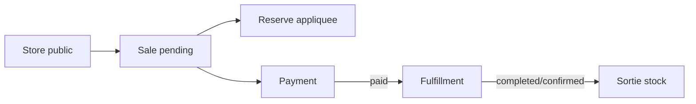
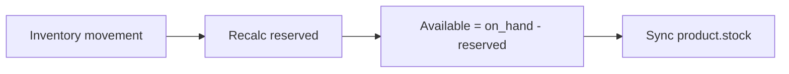
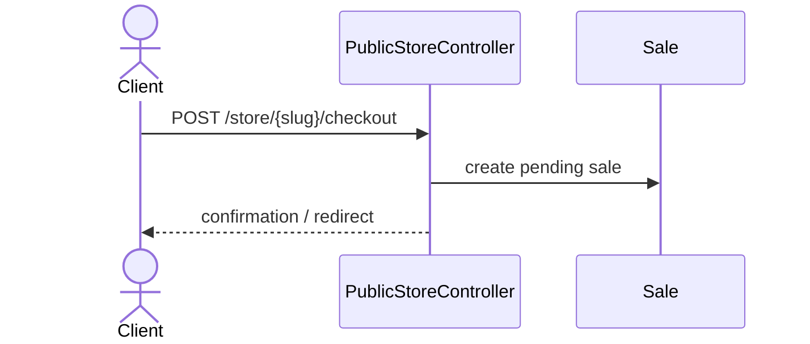
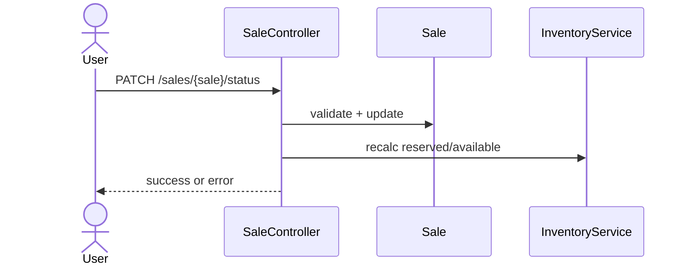
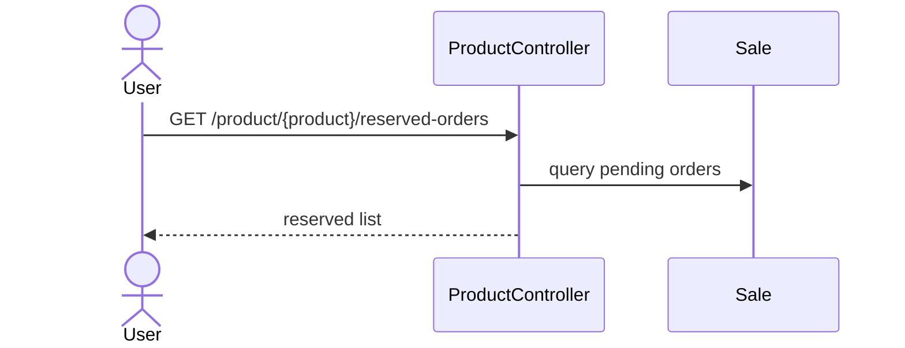
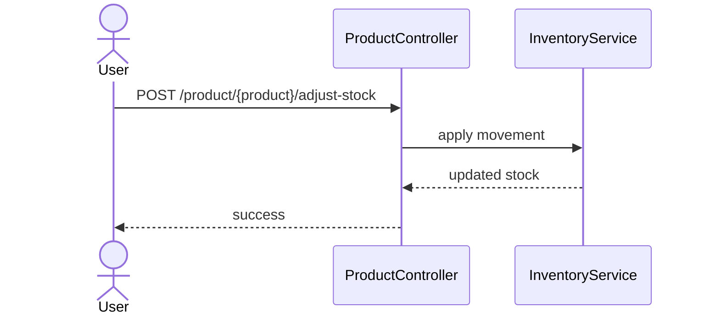
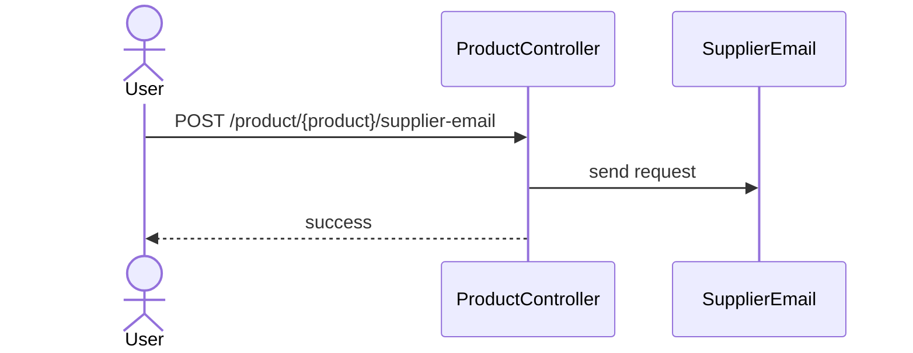

# WORKFLOW - ENTREPRISES DE PRODUITS (RETAIL)

Derniere mise a jour: 2026-01-30

Ce document est la reference fonctionnelle pour les entreprises de produits.
Il decrit les statuts, les regles, les validations et les effets de bord du flux complet :
- catalogue -> stock -> boutique publique -> commande -> paiement -> fulfillment -> stock.

---

## 0.1 Index / TOC
- [0. Glossaire rapide](#0-glossaire-rapide)
- [1. Roles, acces, permissions](#1-roles-acces-permissions)
- [2. Parametres boutique](#2-parametres-boutique-store-et-validations)
- [3. Catalogue produits](#3-catalogue-produits)
- [4. Entrepots & inventaire](#4-entrepots--inventaire)
- [5. Promotions](#5-promotions)
- [6. Boutique publique](#6-boutique-publique-store)
- [7. Creation de commande](#7-creation-de-commande-sale)
- [8. Statuts de vente](#8-statuts-de-vente-salestatus)
- [9. Fulfillment](#9-fulfillment-salefulfillment_status)
- [10. Paiements](#10-paiements)
- [11. Reservations](#11-reservations-reserve)
- [12. Sortie de stock](#12-sortie-de-stock-inventory-applied)
- [13. Notes / details commandes reservees](#13-notes--details-commandes-reservees-modal-produit)
- [14. Notifications](#14-notifications)
- [15. Scenarios tests rapides](#15-scenarios-tests-rapides)
- [16. Points de controle](#16-points-de-controle-checks-rapides)
- [17. Choses a savoir](#17-choses-a-savoir--subtilites)
- [18. Source de verite](#18-source-de-verite-modeles--services)
- [19. Tableaux d etats](#19-tableaux-d-etats-complets)
- [20. Diagrammes (Mermaid)](#20-diagrammes-mermaid)
- [21. Glossaire etendu](#21-glossaire-etendu)
- [22. Flows API](#22-flows-api-web--api-json)
- [23. Exemples si-x-alors-y](#23-exemples-si-x-alors-y-par-ecran)
- [24. Diagrammes par ecran (sequence)](#24-diagrammes-par-ecran-sequence)
- [25. FAQ operationnelle](#25-faq-operationnelle)

---

## 0. Glossaire rapide
- **Produit**: article vendable (SKU, prix, stock, images, etc.).
- **Sale / Vente**: commande interne (POS) ou commande publique (store/portal).
- **Sale item**: ligne d article dans une vente.
- **Fulfillment**: livraison/retrait et progression (preparing, out_for_delivery, etc.).
- **Reserved**: quantite reservee pour des ventes pending.
- **On hand**: stock physique dans un entrepot.
- **Available**: somme des (on_hand - reserved).
- **Tracking**: suivi de stock standard / lot / serial.

---

## 1. Roles, acces, permissions
Roles internes:
- **Proprietaire**: acces complet.
- **Admin** (team member): gestion ventes / stocks selon permissions.
- **Membre** (team member): acces limite.

Permissions importantes (exemples):
- `sales.manage` / `sales.pos`: autorisent gestion ventes + POS.
- `products.manage` (selon configuration): gestion produits.

Notes:
- Les ventes produits sont gerees par l equipe, avec restrictions si l utilisateur n est pas owner.
- Les notifications stock bas et commandes sont visibles pour owner + membres avec ventes.

---

## 2. Parametres boutique (store) et validations
Ecran: `Settings > Company > Store`

### 2.1. Options de fulfillment (livraison / retrait)
Champs stockes dans `company_fulfillment`:
- `delivery_enabled` (bool)
- `pickup_enabled` (bool)
- `delivery_fee` (number)
- `delivery_zone` (string)
- `pickup_address` (string)
- `prep_time_minutes` (int)
- `delivery_notes` (string)
- `pickup_notes` (string)

**Regles de validation:**
- Si `delivery_enabled` = true, `delivery_zone` est **obligatoire**.
- Si `pickup_enabled` = true, `pickup_address` **et** `prep_time_minutes` sont **obligatoires**.
- Si aucun mode n est active, le checkout public est bloque avec message: *"Livraison ou retrait non configure."*

### 2.2. Impact sur le checkout public
Lors du checkout:
- Si l entreprise n a **que livraison**: la methode `delivery` est forcee.
- Si l entreprise n a **que retrait**: la methode `pickup` est forcee.
- Si les deux sont actives: le client choisit.

**Validations checkout**:
- Si methode = `delivery` alors `delivery_address` est obligatoire.
- Si methode = `pickup`, pas d adresse requise.

---

## 3. Catalogue produits
### 3.1. Creation produit
Champs principaux:
- Nom, SKU, code-barres
- Prix
- Taxe
- Unites
- Categorie
- Stock initial
- Fournisseur + email fournisseur (pour demandes de stock)
- Images (cover + galerie)

### 3.2. Suivi de stock (tracking)
- **Standard**: stock global par entrepot (pas de lots/serials).
- **Lot**: gestion par lot + expiration possible.
- **Serial**: chaque entree correspond a un numero de serie unique.

Regles:
- Tracking `serial` requiert un numero de serie pour chaque mouvement.
- Tracking `lot` requiert un numero de lot.
- En tracking `serial`, la quantite du lot = 1 (entree) ou 0 (sortie).

---

## 4. Entrepots & inventaire
### 4.1. Calcul stock
- **On hand** = stock physique dans un entrepot.
- **Reserved** = stock reserve pour ventes pending.
- **Available** = somme des max(0, on_hand - reserved) sur tous les entrepots.
- `product.stock` = **Available** (synchro automatique).

### 4.2. Reserve (reserved)
- Le reserve est ajuste par le systeme selon l etat des ventes.
- Le reserve **ne peut pas** passer sous 0.

### 4.3. Avaries / ajustements / transferts
- Mouvement d ajustement cree des lignes `inventory_movements`.
- Transfert genere un `transfer_out` puis `transfer_in`.
- Apres chaque mouvement: re-sync stock produit.

### 4.4. Stock bas (alertes)
- Si `minimum_stock` > 0 et que le stock passe en-dessous ou egal:
  - Alerte envoyee aux membres avec `sales.manage` ou `sales.pos` + proprietaire.

---

## 5. Promotions
Champs:
- Rabais (%)
- Date debut
- Date fin

Regles:
- Le prix promo est affiche dans la boutique si la date est dans la plage active.
- En dehors de la plage, le prix normal est affiche.

---

## 6. Boutique publique (store)
Fonctions principales:
- Recherche, filtres, categories
- Sections: **Promotions**, **Arrivages**, **Meilleurs vendeurs**
- Produit vedette (si active)

Le store se base sur les produits actifs, en stock, et leurs parametres d images.

---

## 7. Creation de commande (sale)
Sources possibles:
- **Public store** (client externe)
- **Portal client** (client connecte)
- **POS** (interne)

Lors d une commande publique:
- `sale.status = pending`
- `sale.fulfillment_status = pending`
- `sale.fulfillment_method = delivery | pickup`
- `delivery_fee` est applique si livraison.

Notes client:
- `customer_notes`, `substitution_allowed`, `substitution_notes` sont sauvegardes.

---

## 8. Statuts de vente (sale.status)
Statuts supportes:
- **draft**: vente brouillon (pas encore validee).
- **pending**: commande recue, reserve applique.
- **paid**: paiement complet.
- **canceled**: annule.

Regles:
- Une vente **paid** ou **canceled** est consideree finalisee (pas de modification critique).
- Une vente **draft** qui recoit un `fulfillment_status` passe automatiquement a **pending**.

---

## 9. Fulfillment (sale.fulfillment_status)
Statuts supportes:
- **pending**
- **preparing**
- **out_for_delivery**
- **ready_for_pickup**
- **completed**
- **confirmed**

Regles de coherence:
- Si `fulfillment_method = pickup`, on ne peut **pas** passer a `out_for_delivery`.
- Si `fulfillment_method = delivery`, on ne peut **pas** passer a `ready_for_pickup`.
- `confirmed` est **autorise uniquement** si le statut est `completed`.
- Une commande livree (`completed/confirmed`) ne peut plus changer de fulfillment.

---

## 10. Paiements
### 10.1. Paiement manuel
- Si paiement manuel marque la vente **paid**, et si pas de fulfillment configure:
  - `fulfillment_status` est force a `completed`.

### 10.2. Paiement Stripe
- Si paiement Stripe, le statut reste **pending** jusqu au paiement confirme.

### 10.3. Paiement complet
- Le statut passe a `paid` si:
  - Total paye >= total vente **et** fulfillment complete.

### 10.4. Depot automatique (portal)
- Si commande **portal** passe a `preparing` et **pas de depot**:
  - depot = 20% du total (si > 0).

---

## 11. Reservations (reserve)
### 11.1. Regle de calcul
Une ligne est consideree reservee si:
- `sale.status = pending`
- ET `fulfillment_status` est **null** OU **pas** dans `completed` / `confirmed`

Donc, reserve = somme des quantites **pending** non livrees.

### 11.2. Application / liberation
- Si la vente est `pending` (et non livree): reserve appliquée.
- Si la vente sort de `pending` ou passe en `completed/confirmed`: reserve liberee.

---

## 12. Sortie de stock (inventory applied)
Le stock physique est decremente quand:
- La vente est **paid** OU
- Le fulfillment est **completed/confirmed**

Si c est deja applique, pas de double sortie.

---

## 13. Notes / details commandes reservees (modal produit)
Dans la fiche produit, le badge **Reserve X** liste:
- numero commande
- client
- quantite
- statut vente
- statut fulfillment
- notes / delivery / pickup notes

Ces donnees proviennent du calcul `reserved_orders` (requete agregée).

---

## 14. Notifications
- **Nouvelle commande**: notification interne.
- **Changement fulfillment**: notification interne + timeline.
- **Stock bas**: alerte aux membres ventes + proprietaire.

---

## 15. Scenarios tests rapides
1. Creer produit stock standard.
2. Commander via store => sale pending + reserve.
3. Marquer fulfillment complete => reserve liberee.
4. Marquer paid => stock sort.
5. Mettre stock sous minimum => alerte.

---

## 16. Points de controle (checks rapides)
- Checkout bloque si aucun mode fulfillment actif.
- Livraison requiert adresse.
- Fulfillment incoherent refuse (pickup vs delivery).
- Confirmation possible uniquement apres `completed`.
- Stock disponible = somme (on_hand - reserved).

---

## 17. Choses a savoir / subtilites
- Le calcul `reserved_orders` ne montre **que** les ventes `pending` non completes.
- Le statut `confirmed` est une confirmation post-livraison (ex: client confirme reception).
- Une commande livree ne peut plus etre annulee.
- Les depots auto ne s appliquent **que** sur les commandes portal et uniquement au passage `preparing`.

---

## 18. Source de verite (modeles / services)
- `App\Models\Sale` (statuts)
- `App\Http\Controllers\SaleController` (regles de transitions)
- `App\Services\InventoryService` (reserved + stock sync)
- `App\Http\Controllers\ProductController` (reserved_orders)
- `App\Http\Controllers\PublicStoreController` (checkout public)

---

## 19. Tableaux d etats (complets)
### 19.1 Statuts vente (sale.status)
| Statut | Description | Conditions / validations | Effets |
| --- | --- | --- | --- |
| draft | Brouillon | Pas de fulfillment | Pas de reserve |
| pending | Commande recue | Reserve appliquee | Bloque stock |
| paid | Paye complet | Paiement >= total | Peut declencher sortie stock |
| canceled | Annule | Action interne | Reserve liberee |

### 19.2 Statuts fulfillment (sale.fulfillment_status)
| Statut | Description | Contraintes | Effets |
| --- | --- | --- | --- |
| pending | En attente | Default | Reserve active |
| preparing | Preparation | Peut declencher depot portal | Notification interne |
| out_for_delivery | En livraison | `fulfillment_method=delivery` | Suivi livraison |
| ready_for_pickup | Pret a retirer | `fulfillment_method=pickup` | Notification client |
| completed | Termine | Bloque changements | Peut sortir stock |
| confirmed | Confirme | Uniquement apres completed | Finalisation |

### 19.3 Tracking stock
| Type | Exigences | Effets |
| --- | --- | --- |
| standard | Aucune | Stock par entrepot |
| lot | Numero de lot requis | Traque lot/expiration |
| serial | Numero de serie unique | Entree/sortie 1 par 1 |

---

## 20. Diagrammes (Mermaid)
### 20.1 Flux commande publique

### 20.2 Flux inventaire

---

## 21. Glossaire etendu
- **POS**: vente interne en caisse.
- **Portal order**: commande client connecte (portail).
- **Delivery vs Pickup**: choix fulfillment qui restreint les statuts.
- **Inventory movement**: ajustement/transfer enregistrant les variations.
- **Reorder point**: seuil de re-approvisionnement (si utilise).
- **Supplier request**: demande de stock envoyee au fournisseur.
- **Reserved orders**: liste des commandes qui bloquent le stock.

---

## 22. Flows API (web + API JSON)
### 22.1 Public store (web)
- `GET /store/{slug}`
- `POST /store/{slug}/cart`
- `PATCH /store/{slug}/cart/{product}`
- `DELETE /store/{slug}/cart/{product}`
- `DELETE /store/{slug}/cart`
- `POST /store/{slug}/checkout`

### 22.2 Backoffice (web)
- Produits: `GET /product`, `POST /product`, `PUT /product/{product}`
- Stock: `POST /product/{product}/adjust-stock`
- Reserve: `GET /product/{product}/reserved-orders`
- Fournisseur: `POST /product/{product}/supplier-email`
- Ventes: `GET /sales`, `POST /sales`, `PATCH /sales/{sale}/status`
- Orders list: `GET /orders`

### 22.3 API JSON (integration)
- `/api/product`, `/api/sales`, `/api/orders` (meme logique, JSON)

---

## 23. Exemples "si X alors Y" par ecran
### 23.1 Settings Store
- **Si** delivery/pickup non configure **alors** checkout bloque.
- **Si** delivery actif sans `delivery_zone` **alors** save refuse.

### 23.2 Store public
- **Si** methode delivery **alors** adresse requise.
- **Si** methode pickup **alors** pas d adresse requise.

### 23.3 Ventes / fulfillment
- **Si** fulfillment incoherent (pickup + out_for_delivery) **alors** refus.
- **Si** status passe a `completed` **alors** reserve liberee.
- **Si** status passe a `paid` + completed **alors** stock sort.

### 23.4 Produits / stock
- **Si** tracking serial **alors** numero de serie obligatoire.
- **Si** stock <= minimum **alors** alerte envoyee.

---

## 24. Diagrammes par ecran (sequence)
### 24.1 Store public (checkout)

### 24.2 Ecran Ventes (status update)

### 24.3 Modal Reserve produit

### 24.4 Ajuster stock (serial/lot)

### 24.5 Demande fournisseur

---

## 25. FAQ operationnelle
### 25.1 Pourquoi "reserve" ne match pas les commandes?
Verifier:
- ventes en `pending`
- fulfillment pas `completed/confirmed`
- recalcul via InventoryService

### 25.2 Pourquoi checkout bloque?
Verifier:
- delivery/pickup active avec champs obligatoires

### 25.3 Pourquoi stock ne sort pas?
Verifier:
- vente `paid` ou fulfillment `completed/confirmed`
- pas de double sortie

### 25.4 Pourquoi serial refuse?
Verifier:
- tracking = serial
- numero de serie unique fourni

