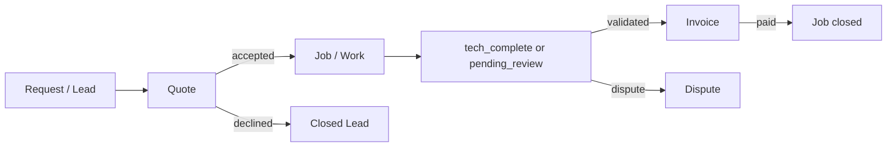
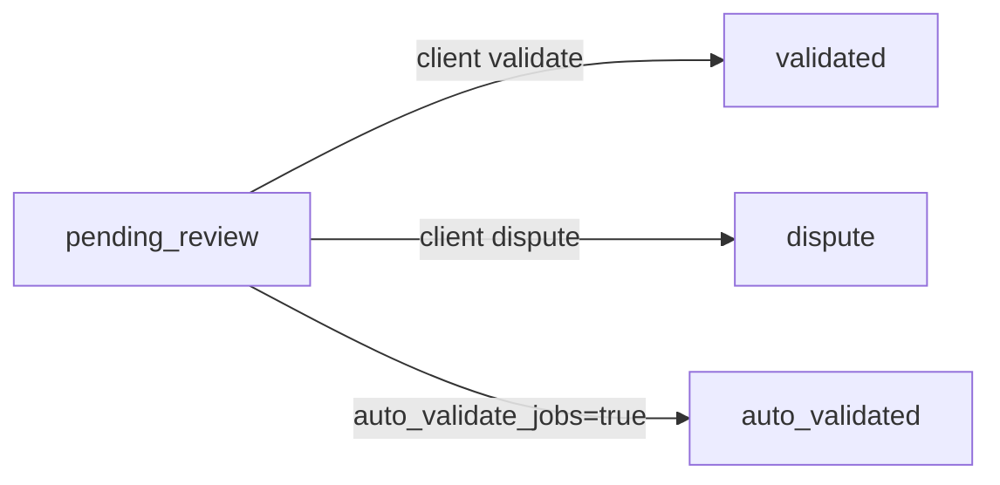
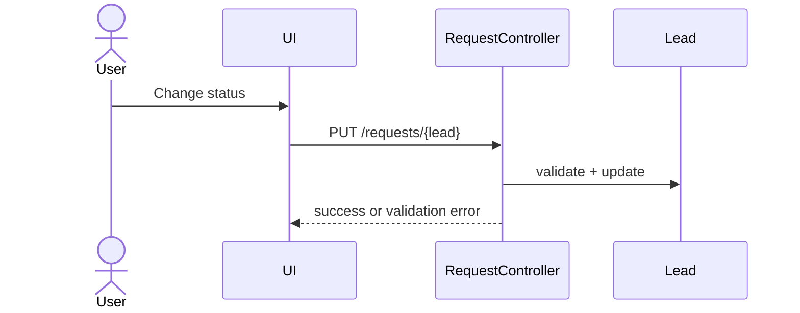
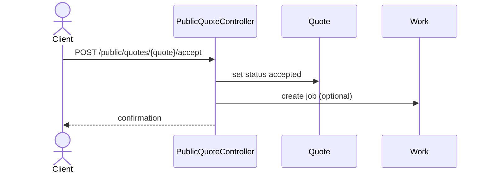
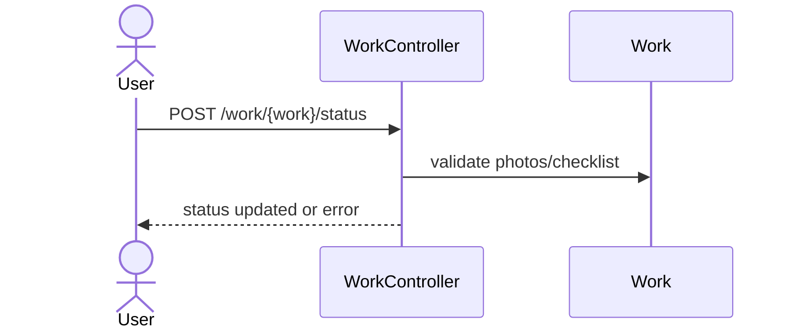
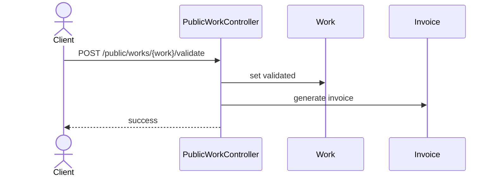

# WORKFLOW - ENTREPRISES DE SERVICES

Derniere mise a jour: 2026-01-30

Ce document est la reference fonctionnelle pour les entreprises de services.
Il decrit les statuts, regles, validations et effets de bord des flux :
lead -> devis -> job -> validation -> facture -> paiement.

---

## 0.1 Index / TOC
- [0. Glossaire rapide](#0-glossaire-rapide)
- [1. Roles & acces](#1-roles--acces)
- [2. Requests (leads)](#2-requests-leads)
- [3. Quotes (devis)](#3-quotes-devis)
- [4. Jobs (works)](#4-jobs-works)
- [5. Validation / dispute (portail client)](#5-validation--dispute-portail-client)
- [6. Facturation & paiements](#6-facturation--paiements)
- [7. Checklist & photos](#7-checklist--photos)
- [8. Taches (tasks)](#8-taches-tasks)
- [9. Portail client](#9-portail-client)
- [10. Automations & cron](#10-automations--cron)
- [11. Edge cases & subtilites](#11-edge-cases--subtilites)
- [12. Scenarios tests rapides](#12-scenarios-tests-rapides)
- [13. Source de verite](#13-source-de-verite-modeles--services)
- [14. Tableaux d etats](#14-tableaux-d-etats-complets)
- [15. Diagrammes (Mermaid)](#15-diagrammes-mermaid)
- [16. Glossaire etendu](#16-glossaire-etendu)
- [17. Flows API](#17-flows-api-web--api-json)
- [18. Exemples si-x-alors-y](#18-exemples-si-x-alors-y-par-ecran)
- [19. Diagrammes par ecran (sequence)](#19-diagrammes-par-ecran-sequence)
- [20. FAQ operationnelle](#20-faq-operationnelle)

---

## 0. Glossaire rapide
- **Request / Lead**: prospect (demande entrante).
- **Quote**: devis (snapshot des lignes de service).
- **Work / Job**: intervention planifiee.
- **Checklist**: liste de taches creee depuis les lignes du devis.
- **Invoice**: facture creee apres validation.

---

## 1. Roles & acces
Roles internes:
- **Proprietaire**: acces complet.
- **Admin**: gestion jobs / devis / factures selon permissions.
- **Membre**: acces limite aux jobs assignes.

Permissions importantes:
- `jobs.view`, `jobs.edit`
- `tasks.view`, `tasks.create`, `tasks.edit`, `tasks.delete`

---

## 2. Requests (leads)
### 2.1. Statuts supportes
- `REQ_NEW`
- `REQ_CONTACTED`
- `REQ_QUALIFIED`
- `REQ_QUOTE_SENT`
- `REQ_WON`
- `REQ_LOST`
- `REQ_CONVERTED`

### 2.2. Regles de transition
- **Lost reason obligatoire** si statut = `REQ_LOST`.
- Si le statut **n est pas LOST**, `lost_reason` est efface.
- Lors de bulk update, la meme regle s applique (lost reason requis).

### 2.3. Champs utiles
- Client lie (`customer_id`) ou client externe.
- Urgence, canal, `next_follow_up_at`, `assigned_team_member_id`, `is_serviceable`.

---

## 3. Quotes (devis)
### 3.1. Creation
1. Choisir un client + propriete.
2. Ajouter lignes (services / produits).
3. Ajouter taxes.
4. Definir acompte (optionnel).
5. Envoyer au client.

### 3.2. Statuts
- `draft`, `sent`, `accepted`, `declined`.

### 3.3. Regles importantes
- Les lignes sont snapshottees dans `quote_products`.
- Un devis **accepte** peut creer un job automatiquement.
- Un devis enfant (`parent_id`) sert aux extras (change order).

---

## 4. Jobs (works)
### 4.1. Statuts supportes
- `to_schedule`, `scheduled`
- `en_route`, `in_progress`
- `tech_complete`
- `pending_review`, `validated`, `auto_validated`, `dispute`
- `closed`, `cancelled`, `completed`

### 4.2. Regles de validation statut
- **in_progress** requiert au moins **3 photos before**.
- **tech_complete** requiert:
  - checklist **100% done**
  - au moins **3 photos after**

### 4.3. Auto-validation
- Si le client a `auto_validate_jobs = true`:
  - le job passe automatiquement a **auto_validated** au lieu de `tech_complete` ou `pending_review`.
  - les actions client (valider / dispute) sont **desactivees**.

### 4.4. Notifications client
Quand le job passe a `tech_complete` ou `pending_review`:
- un email est envoye au client (ou lien public temporaire si pas de portail).
- lien valide 7 jours.

---

## 5. Validation / dispute (portail client)
### 5.1. Conditions
Le client peut **valider** ou **mettre en dispute** uniquement si:
- statut = `pending_review` **ou** `tech_complete`
- ET `auto_validate_jobs = false`

Sinon:
- actions refusees avec message d erreur.

### 5.2. Effets
- `validate` => statut `validated`
- `dispute` => statut `dispute`
- un email est envoye au proprietaire.

---

## 6. Facturation & paiements
### 6.1. Creation facture
- Une facture est generee quand le job passe a `validated` ou `auto_validated`.
- La generation suit les regles du service de facturation (TaskBillingService).

### 6.2. Paiement
- Statuts facture: `draft`, `sent`, `partial`, `paid`, `overdue`, `void`.
- Paiement complet => job passe a `closed`.

---

## 7. Checklist & photos
- Checklist creee automatiquement a partir des lignes du devis.
- Chaque item peut etre `done` / `pending`.
- Photos before/after sont requises pour la progression.

---

## 8. Taches (tasks)
- Statuts: `todo`, `in_progress`, `done`.
- Une tache peut etre liee a un client, un job, ou un produit.

---

## 9. Portail client
Le client peut:
- voir ses devis et les accepter / refuser.
- valider un job ou le mettre en dispute (si autorise).
- payer ses factures.
- noter devis et jobs.

---

## 10. Automations & cron
- Cron auto validation: `php artisan workflow:auto-validate`.
- Liens publics temporaires (7 jours) pour validation/dispute.

---

## 11. Edge cases & subtilites
- Si `auto_validate_jobs = true`, aucune action client possible.
- Un job **dispute** n est pas facturable automatiquement.
- Un job **cancelled** sort du flux facture.
- La validation client cree un log d activite + email au proprietaire.

---

## 12. Scenarios tests rapides
1. Creer request => passer `REQ_QUOTE_SENT`.
2. Creer devis => passer `accepted`.
3. Job: ajouter 3 before, start.
4. Terminer checklist + 3 after => `tech_complete`.
5. Client valide => facture generee.
6. Paiement complet => job `closed`.

---

## 13. Source de verite (modeles / services)
- `App\Models\Request` (statuts leads)
- `App\Models\Quote` (statuts devis)
- `App\Models\Work` (statuts jobs)
- `App\Http\Controllers\WorkController` (regles photos/checklist)
- `App\Http\Controllers\PublicWorkController` (regles portail)
- `App\Services\TaskBillingService` / `WorkBillingService`

---

## 14. Tableaux d etats (complets)
### 14.1 Requests (lead)
| Statut | Description | Validations / contraintes | Effets importants |
| --- | --- | --- | --- |
| REQ_NEW | Lead cree | Aucune | Visible dans pipeline |
| REQ_CONTACTED | Contact effectue | Aucune | Suivi possible |
| REQ_QUALIFIED | Lead qualifie | Aucune | Conversion vers devis possible |
| REQ_QUOTE_SENT | Devis envoye | Aucune | Suivi de reponse client |
| REQ_WON | Gagne | Aucune | Interne (tracking) |
| REQ_LOST | Perdu | `lost_reason` obligatoire | `lost_reason` conserve |
| REQ_CONVERTED | Converti | Via conversion | Lie a un devis |

Notes:
- Le controller permet toute transition **dans** `LeadRequest::STATUSES`.
- Si statut != `REQ_LOST`, `lost_reason` est force a `null`.

### 14.2 Quotes
| Statut | Description | Preconditions | Effets |
| --- | --- | --- | --- |
| draft | Brouillon | Lignes modifiables | Pas de job |
| sent | Envoye | Devis valide | Accessible au client |
| accepted | Accepte | Action client/owner | Peut creer un job |
| declined | Refuse | Action client/owner | Aucun job |

### 14.3 Jobs
| Statut | Description | Preconditions | Effets |
| --- | --- | --- | --- |
| to_schedule | A planifier | Devis accepte | Planning requis |
| scheduled | Planifie | Date assignee | Preparer equipe |
| en_route | En route | Optionnel | Tracking |
| in_progress | En cours | >= 3 photos before | Debut execution |
| tech_complete | Tech termine | Checklist 100% + >= 3 photos after | QA |
| pending_review | En attente client | `auto_validate_jobs = false` | Client peut valider/dispute |
| auto_validated | Auto valide | `auto_validate_jobs = true` | Facturation auto |
| validated | Valide | Action client | Facture generee |
| dispute | En litige | Action client | Stop facturation auto |
| closed | Ferme | Paiement complet | Fin workflow |
| cancelled | Annule | Action interne | Sort du flux facture |
| completed | Termine (legacy) | Selon usage | Aucun effet additionnel |

### 14.4 Invoices
| Statut | Description | Regle |
| --- | --- | --- |
| draft | Brouillon | Non envoye |
| sent | Envoye | En attente paiement |
| partial | Partiel | Paiement partiel |
| paid | Paye | Job passe a `closed` |
| overdue | En retard | Selon regles delai |
| void | Annule | Facture desactivee |

---

## 15. Diagrammes (Mermaid)
### 15.1 Flux principal services

### 15.2 Validation / dispute

---

## 16. Glossaire etendu
- **Auto-validate**: validation automatique sans action client.
- **Change order**: devis additionnel lie a un job (`parent_id`).
- **Public link**: lien temporaire (7 jours) pour action client sans portail.
- **Portal user**: client connecte avec acces limite.
- **Schedule confirm/reject**: confirmation ou refus de date via portail.
- **Lead channel**: source du lead (web, phone, sms, api, import).
- **Dispute**: litige client qui bloque la facturation auto.

---

## 17. Flows API (web + API JSON)
### 17.1 Backoffice (web)
- Requests: `GET /requests`, `POST /requests`, `PUT /requests/{lead}`, `PATCH /requests/bulk`, `POST /requests/{lead}/convert`
- Quotes: `GET /quotes`, `POST /customer/quote/store`, `POST /quote/{quote}/accept`, `POST /quote/{quote}/convert`
- Jobs: `GET /jobs`, `POST /work`, `POST /work/{work}/status`, `POST /work/{work}/extras`

### 17.2 Public / portail
- Quotes (public): `GET /public/quotes/{quote}`, `POST /public/quotes/{quote}/accept`, `POST /public/quotes/{quote}/decline`
- Works (public): `GET /public/works/{work}`, `POST /public/works/{work}/validate`, `POST /public/works/{work}/dispute`
- Requests (public form): `GET /public/requests/{user}`, `POST /public/requests/{user}`

### 17.3 API JSON (integration)
- `/api/requests`, `/api/quotes`, `/api/work` (meme logique, JSON)
- Portal API: `/api/quotes/{quote}/accept`, `/api/works/{work}/validate`, etc.

---

## 18. Exemples "si X alors Y" par ecran
### 18.1 Ecran Leads
- **Si** statut = `REQ_LOST` sans `lost_reason` **alors** erreur de validation.
- **Si** conversion lead sans client/propriete **alors** rejet.

### 18.2 Ecran Devis
- **Si** devis `accepted` **alors** job cree ou peut etre cree.
- **Si** devis `declined` **alors** pas de job.

### 18.3 Ecran Job
- **Si** `in_progress` sans 3 photos before **alors** blocage.
- **Si** `tech_complete` sans checklist 100% **alors** blocage.
- **Si** `auto_validate_jobs = true` **alors** pas d action client possible.

### 18.4 Portail client
- **Si** statut != `pending_review/tech_complete` **alors** validation/dispute refusees.
- **Si** job valide **alors** facture generee.

---

## 19. Diagrammes par ecran (sequence)
### 19.1 Ecran Leads (update status)

### 19.2 Ecran Devis (accept)

### 19.3 Ecran Job (status update)

### 19.4 Portail Client (validate/dispute)

---

## 20. FAQ operationnelle
### 20.1 Pourquoi le client ne peut pas valider?
Ca arrive si:
- le job n est pas `pending_review` ou `tech_complete`
- `auto_validate_jobs = true`

### 20.2 Pourquoi le job ne passe pas a in_progress?
Verifier:
- au moins 3 photos before
- permissions `jobs.edit`

### 20.3 Pourquoi pas de facture?
Verifier:
- job `validated` ou `auto_validated`
- pas en `dispute` ou `cancelled`

### 20.4 Le lien public est expire
Le lien public est valide 7 jours. Regenerer un lien ou inviter le client au portail.

